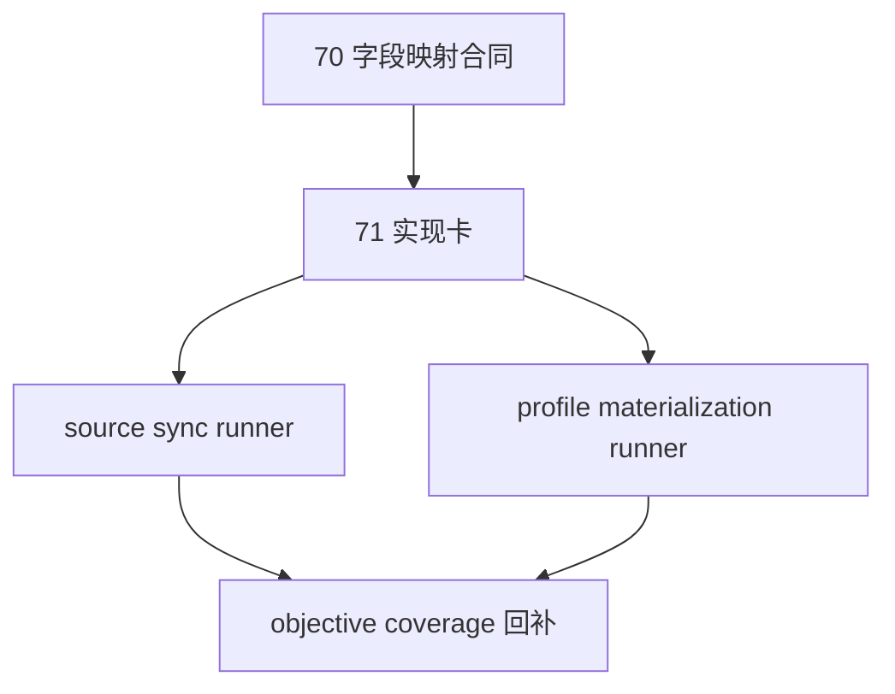

# Tushare objective source runner 与 objective profile materialization 结论
`结论编号：71`
`日期：2026-04-15`
`状态：草稿`

## 裁决

- 接受：
  将 `71` 作为 `70` 之后的直接实现卡，正式进入 `Tushare objective source runner/schema` 与 `event -> raw_tdxquant_instrument_profile` materialization。
- 接受：
  本卡实现拆成两个正式入口：
  - `run_tushare_objective_source_sync(...)`
  - `run_tushare_objective_profile_materialization(...)`
- 拒绝：
  在 `71` 内继续追加新的 source probe。
- 拒绝：
  在 `71` 内顺手改 `raw_tdxquant_instrument_profile` 合同名。

## 原因

- `70` 已经把主源、字段映射与账本化形态裁清，继续 probe 不能再提供新的主线价值。
- `filter` 当前需要的是可只读消费的历史 objective snapshot，而不是更多接口观察笔记。
- 如果只做 source ledger 不做 materialization，`69` 的 coverage 缺口仍无法真正下降。

## 影响

- 后续提交应直接围绕 `src/mlq/data`、`scripts/data` 与 `tests/unit/data` 进入代码实现。
- `80-86` 的恢复前提，将从抽象 source selection 进一步推进为可读的 objective 历史账本与 snapshot。

## 结论结构图

