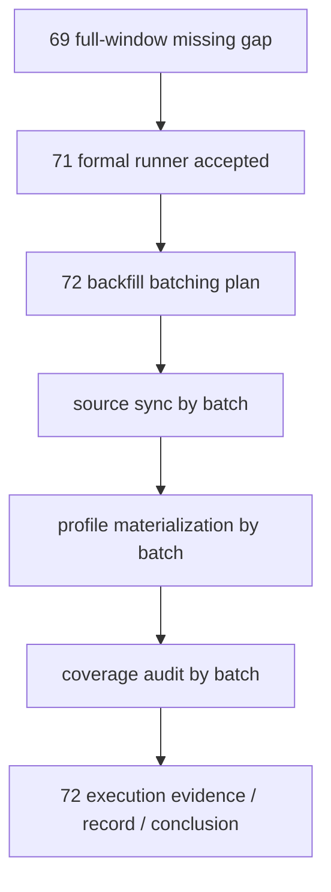

# 历史 objective profile 回补执行

`卡片编号：72`
`日期：2026-04-15`
`状态：草稿`

## 需求
- 问题：`69` 已确认正式库在 `2010-01-04 -> 2026-04-08` 全窗口存在 `100% missing` 的 objective coverage 缺口，而 `71` 已证明正式 runner 能把小窗口缺口降到 `0 missing`，当前缺的是历史全窗口正式回补执行，而不是继续做 source probe 或实现可行性验证。
- 目标结果：基于 `71` 已冻结的正式 runner，把 `2010-01-04 -> 2026-04-08` 的历史 objective profile 分批回补进 `raw_market`，并让每个批次都具备 `source sync -> profile materialization -> coverage audit -> readout` 闭环。
- 为什么现在做：`71` 已接受，再继续在 `71` 内扩 bounded smoke 会把“实现验收卡”和“历史回补执行卡”混成一张卡，当前主线真正需要的是独立的历史回补执行计划、批次治理与正式证据闭环。

## 设计输入

- 设计文档：
  - `docs/01-design/modules/data/07-historical-objective-profile-backfill-source-selection-and-governance-charter-20260415.md`
  - `docs/01-design/modules/data/08-tushare-objective-source-ledger-and-profile-materialization-charter-20260415.md`
- 规格文档：
  - `docs/02-spec/modules/data/07-historical-objective-profile-backfill-source-selection-and-governance-spec-20260415.md`
  - `docs/02-spec/modules/data/08-tushare-objective-source-ledger-and-profile-materialization-spec-20260415.md`
  - `docs/02-spec/modules/filter/01-filter-formal-snapshot-spec-20260409.md`
- 已生效结论：
  - `docs/03-execution/69-filter-objective-tradability-and-universe-gate-freeze-conclusion-20260415.md`
  - `docs/03-execution/70-historical-objective-profile-backfill-source-selection-and-governance-conclusion-20260415.md`
  - `docs/03-execution/71-tushare-objective-source-ledger-and-profile-materialization-conclusion-20260415.md`

## 任务分解

1. 回补批次方案冻结
   - 冻结 `2010-01-04 -> 2026-04-08` 的批次切分口径。
   - 明确每批的 bounded window、标的范围、执行顺序与报告产物路径。
2. 正式回补执行
   - 对每个批次依次执行 `run_tushare_objective_source_sync.py`。
   - 对每个批次依次执行 `run_tushare_objective_profile_materialization.py`。
   - 必要时做最小实现修复，但只允许围绕 `src/mlq/data / scripts/data / tests/unit/data` 的正式契约修复，不得临时绕写数据。
3. 审计与覆盖率读数
   - 每个批次执行 `run_filter_objective_coverage_audit.py` 或对应 readout。
   - 固化每批 `event/profile/coverage` 三类摘要。
4. 执行文档收口
   - 在 `72` 的 evidence / record / conclusion 中回填批次执行结果、异常、偏差与剩余风险。

## 实现边界

- 范围内：
  - `H:\Lifespan-data\raw\raw_market.duckdb`
  - `H:\Lifespan-data\filter\filter.duckdb`
  - `scripts/data/run_tushare_objective_source_sync.py`
  - `scripts/data/run_tushare_objective_profile_materialization.py`
  - `scripts/filter/run_filter_objective_coverage_audit.py`
  - 如 smoke 暴露实现缺口，允许最小修复：
    - `src/mlq/data`
    - `scripts/data`
    - `tests/unit/data`
  - `docs/03-execution/72-*`
- 范围外：
  - 新的 source probe
  - `Baostock` 正式写库
  - `filter` 消费契约改写
  - `raw_tdxquant_instrument_profile` 合同名改写
  - 脱离 bounded window 的无边界全量重算

## 历史账本约束
- 实体锚点：正式 objective 历史账本与 profile snapshot 都锚定 `asset_type + code`。
- 业务自然键：source event 使用 `asset_type + code + source_api + objective_dimension + effective_start_date + source_record_hash`，profile snapshot 使用 `asset_type + code + observed_trade_date`。
- 批量建仓：按 `2010-01-04 -> 2026-04-08` 分批执行 bounded window backfill，每个批次固定为先 source sync、再 materialization、再 coverage audit。
- 增量更新：历史回补完成后继续由 `71` 已落地的正式 runner 维护未来窗口增量；如某批次补修或重放，只允许重算受影响窗口，不得无边界重算全历史。
- 断点续跑：source sync 使用 `exchange_status / trade_date / instrument` 三类 checkpoint，materialization 使用 `asset_type + code + observed_trade_date` checkpoint，执行卡按批次记录重跑边界与失败批次恢复点。
- 审计账本：`tushare_objective_run / request / checkpoint / event`、`objective_profile_materialization_run / checkpoint / run_profile`、`raw_tdxquant_instrument_profile` 与 `filter objective coverage audit` markdown/json 报告必须共同构成正式审计链路。

## 收口标准

1. `72` 明确冻结历史回补批次方案，并在正式库执行至少首批回补。
2. 每个已执行批次都具备 `source sync + profile materialization + coverage audit` 的正式证据。
3. 如执行过程中暴露实现缺口，修复必须补单测，并再次通过治理检查。
4. evidence / record / conclusion 写完，能够明确说明：
   - 已执行到哪一批
   - coverage 下降了多少
   - 剩余窗口与风险是什么

## 卡片结构图

