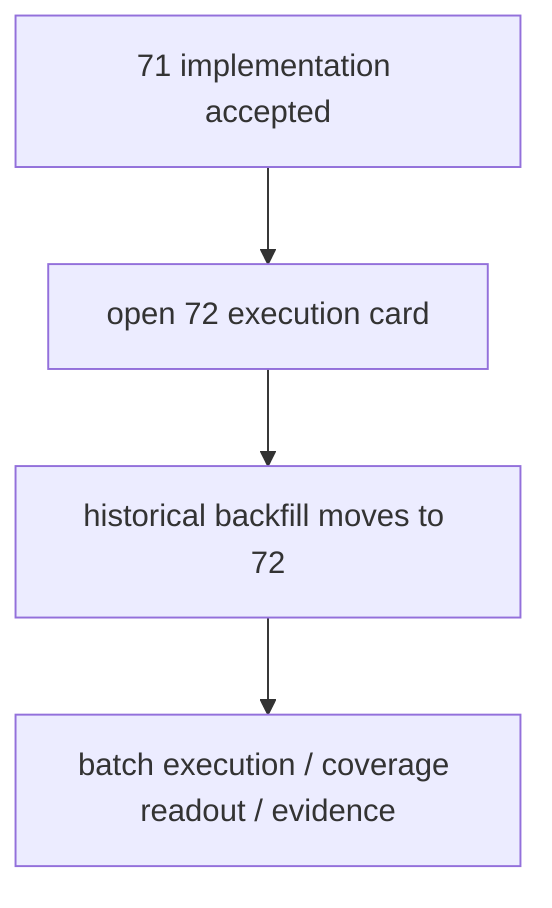

# 历史 objective profile 回补执行 结论

`结论编号：72`
`日期：2026-04-15`
`状态：草稿`

## 裁决

- 接受：
  - 不再在 `71` 内继续扩大 bounded window。
  - 直接单开 `72`，作为“历史 objective profile 回补执行”正式卡。
- 拒绝：
  - 把历史回补执行继续挂在 `71` 名下。
  - 回到 `Tushare / Baostock` probe 或重新讨论主源选型。

## 原因

- `71` 已经完成正式实现与真实 bounded smoke 验收，它的职责已经收口。
- 当前真正需要推进的是历史全窗口回补执行，而不是继续在实现验收卡里追加更多执行批次。
- 单独开 `72` 后，历史回补的批次进度、coverage 变化、异常与重跑边界才能形成清晰的执行文档闭环。

## 影响

- 当前正式待施工卡已切换到 `72-historical-objective-profile-backfill-execution-card-20260415.md`。
- 后续围绕历史回补的正式动作，应默认在 `72` 内记录：
  - 批次切分
  - source sync 执行
  - profile materialization 执行
  - coverage audit 结果
  - 执行中暴露的最小实现修复

## 结论结构图

