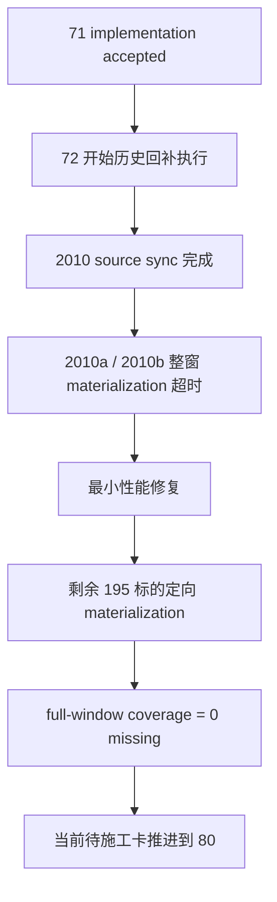

# 历史 objective profile 回补执行 结论

`结论编号：72`
`日期：2026-04-15`
`状态：接受`

## 裁决

- 接受：
  - `72` 已完成 `2010-01-04 -> 2010-12-31` 首批历史 objective profile 正式回补执行。
  - `2010-01-04 -> 2026-04-08` 的 full-window `filter objective coverage audit` 已达到 `0 missing`。
  - `72` 期间为 `profile materialization` 补的最小性能修复可以保留为正式实现。
- 拒绝：
  - 继续把历史回补执行挂在 `71` 名下。
  - 继续用“整窗全量重扫 + 等待超时”方式推进后续历史回补。

## 原因

- `71` 已完成最小正式实现，`72` 的职责是把 runner 推进到真实历史回补执行，而不是继续堆 smoke。
- `72-backfill-source-2010a` 已证明 `2010` 首批窗口的 source ledger 可以完整落入正式库，`inserted_event_count = 16497`，没有 request 级失败。
- 两次整窗 materialization (`2010a/2010b`) 都暴露了同一个执行现实：对 `392478` 个 candidate 直接整窗重扫会在本地 DuckDB + PowerShell 超时约束下失去可操作性。
- 最小性能修复后，再根据 checkpoint 缺口把剩余范围收缩到 `195` 个标的 / `42720` 条缺口 profile，`72-backfill-profile-2010c` 已成功补齐尾部缺口并把 full-window coverage 拉到 `6835 covered / 0 missing`。

## 影响

- `raw_market.raw_tdxquant_instrument_profile` 现已在 `2010-01-04 -> 2010-12-31` 窗口累计 `392478` 条 profile，覆盖 `1833` 个标的。
- 当前 `filter_snapshot` 在 `2010-01-04 -> 2026-04-08` 窗口的 objective coverage 已从 `6833 missing / 2 covered` 变为 `0 missing / 6835 covered`。
- `72` 收口后，当前正式待施工卡应从 `72` 推进到 `80-mainline-middle-ledger-2011-2013-bootstrap-card-20260414.md`。
- 后续若再做更大历史 objective 回补，应默认沿用：
  - `source sync`
  - `profile materialization`
  - `coverage audit`
  - 缺口定向 replay
  这条执行闭环，而不是重新回到 probe 或无边界全量重算。

## 结论结构图

