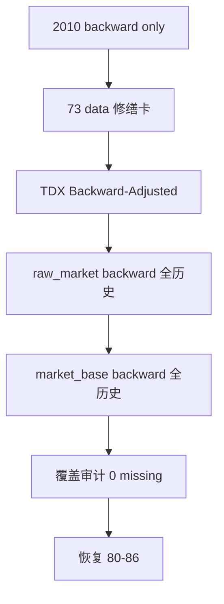

# market_base backward 全历史修缮与补全

卡片编号：`73`
日期：`2026-04-16`
状态：`已完成`

## 需求

- 问题：`raw_market` 与 `market_base` 已经成为正式账本，但 `market_base.stock_daily_adjusted(adjust_method='backward')` 当前仍只落到 `2010-01-04 -> 2010-12-31` 官方 pilot 窗口。`malf -> structure -> filter -> alpha` 默认消费 `backward` 口径；若 `backward` 不补齐全历史，`80 -> 86` 的 official middle-ledger 分窗恢复会被基础价格覆盖不足阻塞。

- 目标结果：从 `H:\tdx_offline_Data` 的官方离线 `Backward-Adjusted` 日线源补齐 `raw_market -> market_base` 的 `backward` 全历史日线数据。至少完成 `stock` 的全历史 `backward` 补齐；如 `index / block` 同源目录可用，则同步完成三类资产的 `backward` raw/base 补齐，并形成可复核的覆盖审计：按 `asset_type + adjust_method` 对比 `raw_market` 与 `market_base` 的行数、标的数、最小日期、最大日期与缺口数。

- 为什么现在做：`72` 已完成 objective profile 覆盖修缮，当前待恢复 `80 -> 86`；但 `80-86` 依赖 `market_base(backward)` 的真实全历史覆盖。若直接推进 `80`，会把“2010 pilot 已通过”误当作“backward 全历史已可用”，导致下游中间账本恢复节奏失真。既有 `market_base full` runner 如果带日期窗或默认 `limit=1000` 执行，存在把同一 `adjust_method` 的非 staging 行删除后只留下局部窗口的风险，必须在本卡冻结全历史补库调用口径。

## 设计输入

- 设计文档：
  - `docs/01-design/00-system-charter-20260409.md`
  - `docs/01-design/01-doc-first-development-governance-20260409.md`
  - `docs/01-design/03-historical-ledger-shared-contract-charter-20260409.md`
  - `docs/01-design/modules/README.md`
- 规格文档：
  - `docs/02-spec/00-repo-layout-and-docflow-spec-20260409.md`
  - `docs/02-spec/01-doc-first-task-gating-spec-20260409.md`
  - `docs/02-spec/Ω-system-delivery-roadmap-20260409.md`
  - `docs/03-execution/17-raw-base-strong-checkpoint-and-dirty-materialization-conclusion-20260410.md`
  - `docs/03-execution/18-daily-raw-base-fq-incremental-update-source-selection-conclusion-20260410.md`
  - `docs/03-execution/20-index-block-raw-base-incremental-bridge-conclusion-20260410.md`
  - `docs/03-execution/22-data-daily-source-governance-sealing-conclusion-20260411.md`
  - `docs/03-execution/39-mainline-local-ledger-standardization-bootstrap-conclusion-20260413.md`
  - `docs/03-execution/40-mainline-local-ledger-incremental-sync-and-resume-conclusion-20260413.md`
  - `docs/03-execution/72-historical-objective-profile-backfill-execution-conclusion-20260415.md`

## 任务分解

1. 切片 1：审计当前 `raw_market / market_base` 的 `backward` 覆盖范围，并确认 `H:\tdx_offline_Data` 的 `Backward-Adjusted` 文件候选数量。
2. 切片 2：按 `stock / index / block` 分资产执行 `TDX -> raw_market` 的 `backward` 全历史增量/重放，保持正式 raw 账本自然键与 dirty queue 语义。
3. 切片 3：按 `stock / index / block` 分资产执行 `raw_market -> market_base` 的 `backward` 全历史补齐；全历史 full 调用必须不带日期窗，并显式关闭默认 row limit。
4. 切片 4：形成补库后覆盖审计、命令证据、运行摘要与缺口检查，并回填 record / conclusion / index。

## 实现边界

- 范围内：
  - `data` 模块官方 `raw_market / market_base` 账本的 `backward` 日线历史覆盖修缮。
  - 必要时补充最小 guardrail 或测试，防止局部 `full` 调用误删全表历史。
  - 证据产物必须进入 `H:\Lifespan-temp` 或 `docs/03-execution/evidence/`，不把临时 DB/缓存堆回仓库。
- 范围外：
  - 不修改 `malf / structure / filter / alpha` 的业务语义。
  - 不重算 `80 -> 86` middle-ledger；本卡只解除其上游 `market_base(backward)` 覆盖阻塞。
  - 不把 `forward` 作为正式执行口径；`forward` 仍仅保留研究/展示用途。
  - 不从下游临时 DataFrame 绕过 `raw_market -> market_base` 正式链路。

## 历史账本约束

- 实体锚点：标的类默认使用 `asset_type + code`；日线事实再叠加 `trade_date + adjust_method`。
- 业务自然键：`raw_market.{asset}_daily_bar` 使用 `bar_nk = code|trade_date|adjust_method`，`market_base.{asset}_daily_adjusted` 使用 `daily_bar_nk = code|trade_date|adjust_method`；`name` 只能作属性与审计辅助。
- 批量建仓：`scripts/data/run_tdx_asset_raw_ingest.py --asset-type {stock,index,block} --adjust-method backward --run-mode full --limit 0` 与 `scripts/data/run_market_base_build.py --asset-type {stock,index,block} --adjust-method backward --build-mode full --limit 0`。
- 增量更新：后续仍由 `run_tdx_asset_raw_ingest.py` 的 size/mtime/hash 指纹识别变化，并通过 `base_dirty_instrument` 驱动 `run_market_base_build.py --build-mode incremental`。
- 断点续跑：raw ingest 保留 `raw_ingest_run / raw_ingest_file` 与 file registry 指纹；base materialization 保留 `base_dirty_instrument / base_build_run / base_build_scope / base_build_action`。
- 审计账本：本卡补库证据以 runner summary、覆盖 SQL、`base_build_run`、`base_build_action`、`raw_ingest_run` 与 `raw_ingest_file` 为准；`run_id` 只做审计，不做业务主语义。

## 收口标准

1. `stock_daily_adjusted(adjust_method='backward')` 覆盖到 `raw_market.stock_daily_bar(adjust_method='backward')` 当前可用全历史范围，且缺口为 `0`。
2. 如 `index / block` 的 `Backward-Adjusted` raw 源可用，对应 `index_daily_adjusted / block_daily_adjusted` 也完成同口径缺口检查。
3. 若补了 guardrail 或测试，测试命令必须登记到 evidence。
4. evidence / record / conclusion / catalog / ledger 均完成回填，最新锚点推进到 `73`，当前待施工卡恢复到 `80`。

## 卡片结构图

