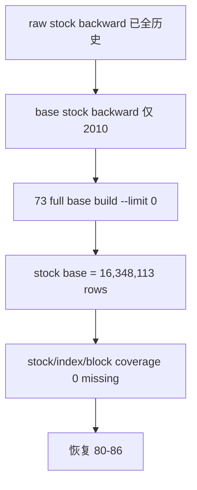

# market_base backward 全历史修缮与补全 结论

结论编号：`73`
日期：`2026-04-16`
状态：`接受`

## 裁决

- 接受：
  - `market_base.stock_daily_adjusted(adjust_method='backward')` 已从 `2010-01-04 -> 2010-12-31` pilot 窗口补齐到 `1990-12-19 -> 2026-04-10` 全历史覆盖。
  - `stock / index / block` 三类资产的 `backward` raw/base 覆盖审计均达到 `0 missing / 0 extra / 0 mismatch`。
  - `market_base full` runner 的缺失行删除权已收紧为真正全量 full：`source_scope_kind='full'` 且无 row limit；局部 full 不再允许误删全历史。
  - `TDX raw ingest` runner 已兼容当前本地 `stock-day / index-day / block-day` 离线源目录布局。
- 拒绝：
  - 继续把 `2010` pilot 窗口误认为 `market_base(backward)` 已全历史可用。
  - 继续使用带日期窗、标的窗或默认 `limit=1000` 的 `full` 调用承担全表删除语义。
  - 在 raw 已全历史覆盖的前提下，为了本卡补库而重复全量 raw ingest 并制造 file registry source path 噪声。

## 原因

- 施工前审计显示：`raw_market.stock_daily_bar(backward)` 已有 `16,348,113` 行、`5,501` 标的、`1990-12-19 -> 2026-04-10`；但 `market_base.stock_daily_adjusted(backward)` 只有 `392,478` 行、`1,833` 标的、`2010-01-04 -> 2010-12-31`。
- 正式补库 run `card73-stock-backward-full-history-20260416` 从 raw staging 处理 `16,348,113` 行，插入 `15,955,635` 行，复用 `392,478` 行，未发生重物化。
- 补后审计证明：
  - `stock` raw/base backward 均为 `16,348,113` 行、`5,501` 标的、`1990-12-19 -> 2026-04-10`。
  - `index` raw/base backward 均为 `377,711` 行、`100` 标的、`1990-12-19 -> 2026-04-10`。
  - `block` raw/base backward 均为 `468,542` 行、`127` 标的、`2011-01-04 -> 2026-04-10`。
- `tests/unit/data/test_market_base_runner.py -q` 已通过 `10 passed`，覆盖本卡新增 guardrail 与 `*-day` 源目录兼容。

## 影响

- `malf -> structure -> filter -> alpha` 默认依赖的 `market_base(backward)` 已具备全历史正式库基础，不再以 `2010` pilot 作为实际覆盖上限。
- `80 -> 86` official middle-ledger resume 可以恢复推进；当前待施工卡应切回 `80-mainline-middle-ledger-2011-2013-bootstrap-card-20260414.md`。
- 后续若需要全历史重物化 `market_base`，必须显式使用无日期窗、无标的窗、`--limit 0` 的真正 full 调用；bounded replay 应使用日期窗/标的窗但不承担全表缺失删除。
- `H:\tdx_offline_Data` 当前 `*-day` 布局已被 runner 兼容，后续 raw ingest 不再依赖历史 `stock/index/block` 目录名。

## 结论结构图

