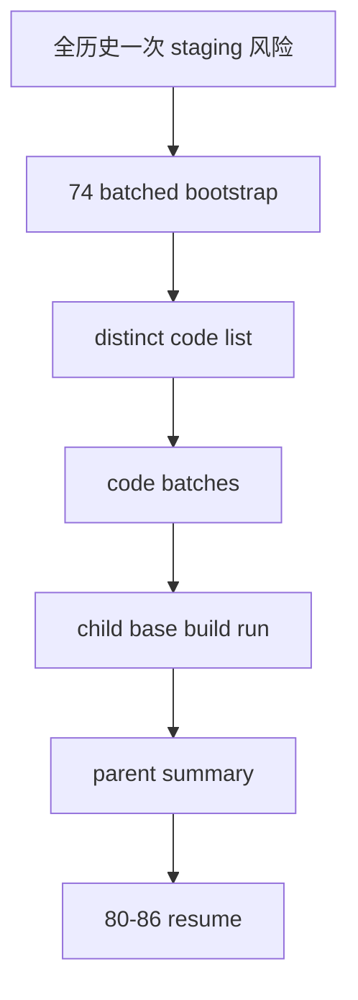

# market_base 分批建仓治理与 runner 修缮

卡片编号：`74`
日期：`2026-04-16`
状态：`已完成`

## 需求

- 问题：`73` 虽然完成了 `market_base(backward)` 全历史补齐，但卡片里的批量建仓命令仍表达为一次性 `--build-mode full --limit 0`。对个人 PC 来说，这会把一个资产类别的全历史 raw rows 一次 staging 到 DuckDB 临时表，再做 MERGE；当 stock 行数达到千万级时，内存、临时 IO 与失败重跑成本都不符合长期 data-grade 口径。
- 目标结果：`scripts/data/run_tdx_asset_raw_ingest.py` 与 `scripts/data/run_market_base_build.py` 必须支持按标的批次执行建仓。批次模式只先读取候选文件/标的清单，再按 `batch_size` 切成多个 child run，每个 child run 只处理本批标的，并分别写入 `raw_ingest_run / raw_ingest_file` 或 `base_build_run / base_build_scope / base_build_action` 审计。
- 为什么现在做：`80 -> 86` 即将恢复 official middle-ledger 分窗建库。若 `data` 的基础建仓口径仍依赖“一口吃掉全历史”，后续任何 raw/base 修缮或 replay 都会在个人 PC 上变得脆弱；本卡应把 `73` 的一次性补库经验沉淀为正式分批能力。

## 设计输入

- 设计文档：
  - `docs/01-design/00-system-charter-20260409.md`
  - `docs/01-design/01-doc-first-development-governance-20260409.md`
  - `docs/01-design/03-historical-ledger-shared-contract-charter-20260409.md`
- 规格文档：
  - `docs/02-spec/00-repo-layout-and-docflow-spec-20260409.md`
  - `docs/02-spec/01-doc-first-task-gating-spec-20260409.md`
  - `docs/02-spec/Ω-system-delivery-roadmap-20260409.md`
  - `docs/03-execution/17-raw-base-strong-checkpoint-and-dirty-materialization-conclusion-20260410.md`
  - `docs/03-execution/20-index-block-raw-base-incremental-bridge-conclusion-20260410.md`
  - `docs/03-execution/73-market-base-backward-full-history-backfill-conclusion-20260416.md`

## 任务分解

1. 切片 1：为 `raw ingest` runner 增加 batched bootstrap 编排入口，按 TDX 文件名生成标的批次。
2. 切片 2：为 `market_base` runner 增加 batched bootstrap 编排入口，按 raw 中 distinct code 生成标的批次。
3. 切片 3：为两个 CLI 增加 `--batch-size`，批次模式输出 parent summary，并把每个 child run 保留为正式审计 run。
4. 切片 4：收紧缺失行删除语义，使 instrument/date scoped full 只删除本作用域内缺失行，不能误删范围外历史。
5. 切片 5：补单元测试验证批次模式不会一次 staging 全资产、child run 可审计、全量结果正确。
6. 切片 6：回填 evidence / record / conclusion / index，并把当前待施工卡恢复到 `80`。

## 实现边界

- 范围内：
  - `scripts/data/run_market_base_build.py`
  - `scripts/data/run_tdx_asset_raw_ingest.py`
  - `src/mlq/data/data_market_base_runner.py`
  - `src/mlq/data/data_market_base_materialization.py`
  - `src/mlq/data/data_raw_runner.py`
  - `src/mlq/data/__init__.py / runner.py`
  - data 单元测试与执行文档闭环。
- 范围外：
  - 不重跑正式库全历史补库；`73` 已完成正式落库，本卡只固化更好的 runner 能力。
  - 不修改 `malf / structure / filter / alpha` 语义。
  - 不引入并发批次；本仓 pytest 与正式库操作仍按串行口径，避免争用 `H:\Lifespan-temp\pytest-tmp` 和 DuckDB writer。

## 历史账本约束

- 实体锚点：`asset_type + code`。
- 业务自然键：`market_base.{asset}_daily_adjusted` 仍使用 `code + trade_date + adjust_method`，批次号与 run_id 只做审计，不进入业务自然键。
- 批量建仓：新增 `run_tdx_asset_raw_ingest.py --batch-size N --run-mode full` 与 `run_market_base_build.py --batch-size N --build-mode full --limit 0`；parent 只负责编排，child run 按 `asset_type + adjust_method + code batch` 逐批落账。
- 增量更新：既有 `base_dirty_instrument` 增量 runner 不改变；本卡只增强 bootstrap/replay 的批次入口。
- 断点续跑：批次模式的每个 child run 都有独立 `run_id`、scope 与 action；失败后可用同一 `--instrument` 或剩余 code 批次重跑，不要求从头全量重扫。
- 审计账本：parent summary 写入 `summary_path`；child run 正式落在 `base_build_run / base_build_scope / base_build_action`。

## 收口标准

1. raw/base 两个 CLI 支持 `--batch-size` 并返回 parent summary。
2. 单元测试证明 batch size 为 1 时会产生多个 child run，且 market rows 完整。
3. instrument/date scoped full 删除只限作用域内，不删除范围外历史。
4. 执行索引、doc-first gate、development governance 通过。
5. 结论接受后当前待施工卡恢复到 `80`。

## 卡片结构图

