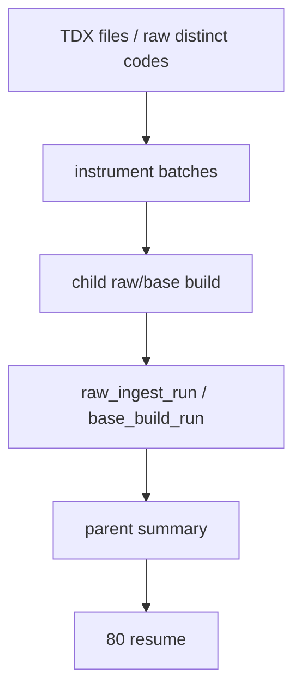

# market_base 分批建仓治理与 runner 修缮 结论

结论编号：`74`
日期：`2026-04-16`
状态：`接受`

## 裁决

- 接受：
  - `raw ingest` 与 `market_base` 正式建仓入口均支持 `--batch-size`，可按标的批次串行建仓，避免一次处理全资产全历史 rows。
  - 批次模式采用 parent summary + child run 的审计结构；raw child run 落 `raw_ingest_run / raw_ingest_file`，base child run 落 `base_build_run / base_build_scope / base_build_action`。
  - instrument/date scoped full 的缺失行删除权已限制在当前作用域内，避免批次建仓误删其他标的或日期范围。
- 拒绝：
  - 把 `--build-mode full --limit 0` 作为长期唯一批量建仓口径。
  - 为了“跑得快”引入并发 writer 争用正式 DuckDB。
  - 让 batch id 或 parent run id 进入业务自然键。

## 原因

- 个人 PC 的内存、临时 IO 与失败重跑成本不适合“一次性 staging 千万级全历史 rows”。
- `run_tdx_asset_raw_ingest_batched(...)` 只先读取候选文件名与 code 清单，再按 `batch_size` 触发多个 raw child run。
- `run_asset_market_base_build_batched(...)` 只先读取 distinct code 清单，再按 `batch_size` 触发多个 base child run；每个 child run 只处理本批标的全历史。
- `tests/unit/data/test_market_base_batched_runner.py` 验证：
  - raw ingest batch size 为 `1` 时会产生多个 child run，且最终 raw rows 完整。
  - batch size 为 `1` 时会产生多个 child run，且最终 market rows 完整。
  - instrument scoped full 只删除当前标的作用域内已从 raw 消失的行。
- `tests/unit/data/test_market_base_batched_runner.py tests/unit/data/test_market_base_runner.py -q` 已通过 `13 passed`。

## 影响

- 后续正式批量建仓优先使用：
  - `python scripts/data/run_tdx_asset_raw_ingest.py --asset-type stock --adjust-method backward --run-mode full --batch-size 100`
  - `python scripts/data/run_market_base_build.py --asset-type stock --adjust-method backward --build-mode full --limit 0 --batch-size 100`
  - `index / block` 可按实际规模选择 `--batch-size`。
- `73` 的全历史补库事实不变；`74` 改变的是后续 bootstrap/replay 的正式执行口径。
- 当前待施工卡恢复到 `78-malf-alpha-dual-axis-refactor-scope-freeze-card-20260418.md`。

## 结论结构图

