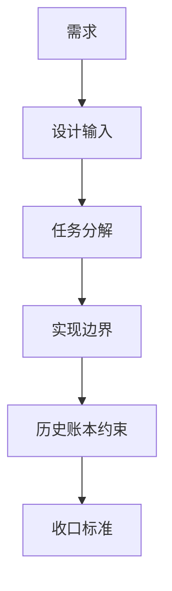

# raw/base 周月线正式账本扩展

卡片编号：`75`
日期：`2026-04-16`
状态：`已完成`

## 需求

- 问题：当前正式 `raw/base` 只有日线表族，但交易观察和下游多周期语义都已经需要 `day / week / month`。同时 `H:\tdx_offline_Data` 的 `*-week / *-month` 目录目前为空，不能假装“周/月本地源已经齐全”。
- 目标结果：把 `scripts/data/run_tdx_asset_raw_ingest.py` 与 `scripts/data/run_market_base_build.py` 正式提升为 `asset_type + timeframe + adjust_method` 通用入口，新增周/月 raw/base 表族，并在 direct-source 缺失时允许从本地日线 txt 做确定性周/月聚合。
- 为什么现在做：`73 / 74` 已经完成日线全历史和分批建仓治理，用户现在明确要求把周/月一起沉淀进官方 DuckDB；如果继续只在下游临时重采样，`data` 模块就仍然不是正式多周期账本入口。

## 设计输入

- 设计文档：
  - `docs/01-design/modules/data/01-tdx-offline-raw-and-market-base-bridge-charter-20260410.md`
  - `docs/01-design/modules/data/02-raw-base-strong-checkpoint-and-dirty-materialization-charter-20260410.md`
  - `docs/01-design/modules/data/05-index-block-raw-base-incremental-bridge-charter-20260410.md`
  - `docs/01-design/modules/data/06-mainline-local-ledger-standardization-charter-20260413.md`
  - `docs/01-design/modules/data/09-raw-base-weekly-monthly-timeframe-ledger-bootstrap-charter-20260416.md`
- 规格文档：
  - `docs/02-spec/modules/data/01-tdx-offline-raw-and-market-base-bridge-spec-20260410.md`
  - `docs/02-spec/modules/data/02-raw-base-strong-checkpoint-and-dirty-materialization-spec-20260410.md`
  - `docs/02-spec/modules/data/05-index-block-raw-base-incremental-bridge-spec-20260410.md`
  - `docs/02-spec/modules/data/06-mainline-local-ledger-standardization-spec-20260413.md`
  - `docs/02-spec/modules/data/09-raw-base-weekly-monthly-timeframe-ledger-bootstrap-spec-20260416.md`
  - `docs/03-execution/74-market-base-batched-bootstrap-governance-conclusion-20260416.md`

## 任务分解

1. 切片 1：扩展 `bootstrap.py` 与共享 contract，新增 `week/month` 表族及 `timeframe` 字段。
2. 切片 2：扩展 raw ingest runner，使其支持 `--timeframe`，并在周/月 direct-source 缺失时回退到日线 txt 聚合。
3. 切片 3：扩展 market_base build runner，使其支持 `--timeframe`、`dirty_queue` 周期隔离和 batched bootstrap。
4. 切片 4：补充 data 单测，覆盖周/月 fallback 聚合、周/月 base 落表、dirty queue 周期隔离。
5. 切片 5：对官方库执行至少一轮 `stock backward week/month` 的 raw + base 正式落表，并形成证据。
6. 切片 6：回填 evidence / record / conclusion / 索引 / 入口文件，并把当前待施工卡恢复到 `80`。

## 实现边界

- 范围内：
  - `src/mlq/data/bootstrap.py`
  - `src/mlq/data/data_common.py`
  - `src/mlq/data/data_shared.py`
  - `src/mlq/data/data_raw_support.py`
  - `src/mlq/data/data_raw_runner.py`
  - `src/mlq/data/data_market_base_scope.py`
  - `src/mlq/data/data_market_base_governance.py`
  - `src/mlq/data/data_market_base_materialization.py`
  - `src/mlq/data/data_market_base_runner.py`
  - `src/mlq/data/__init__.py`
  - `src/mlq/data/runner.py`
  - `scripts/data/run_tdx_asset_raw_ingest.py`
  - `scripts/data/run_market_base_build.py`
  - `tests/unit/data/*`
- 范围外：
  - 改写 `malf / structure / filter / alpha` 的多周期消费逻辑
  - 为 `trade / system` 新增周/月消费合同
  - 引入并发写库
  - 重命名既有日线正式表

## 历史账本约束

- 实体锚点：`asset_type + timeframe + code`
- 业务自然键：对应 `raw/base` 周期表内仍使用 `code + trade_date + adjust_method`；共享 dirty/audit 表使用 `asset_type + timeframe + code + adjust_method`
- 批量建仓：正式入口使用 `--timeframe <day|week|month> --batch-size N`，parent 只编排，child run 分批落审计
- 增量更新：周/月 direct-source 有文件时按对应源更新；无文件时从日线 txt 做确定性重放，仍只更新当前 `timeframe`
- 断点续跑：`raw_ingest_run / raw_ingest_file / base_build_run / base_build_scope / base_build_action / base_dirty_instrument` 全部显式带 `timeframe`
- 审计账本：官方落表仍在 `raw_market.duckdb / market_base.duckdb`，汇总写入 `summary_path`

## 收口标准

1. `raw/base` runner 与 CLI 正式支持 `--timeframe`
2. 周/月表族与共享 `timeframe` 审计字段完成 bootstrap/migration
3. 单测覆盖 direct-source/fallback/base/dirty 四类路径并通过
4. 官方库完成周线、月线真实落表并有 readout 证据
5. `doc-first gating`、execution indexes、development governance 通过
6. 结论接受后当前待施工卡恢复到 `80`

## 卡片结构图

