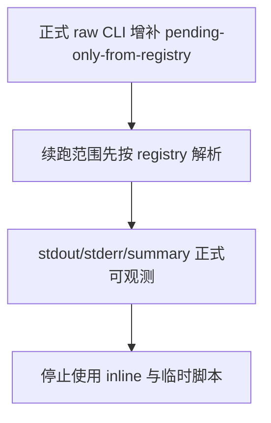

# raw/base 周月线正式账本扩展结论

结论编号：`75`
日期：`2026-04-16`
状态：`接受`

## 裁决

- 接受：`raw/base` 周月线正式账本扩展已收口，且 stock week/month 的尾部续跑现在有正式 CLI 入口，不再需要 inline `python -` 或仓库外临时脚本。

## 原因

- `scripts/data/run_tdx_asset_raw_ingest.py` 已正式支持 `--pending-only-from-registry`，能够先按官方 `raw_market.{asset}_file_registry` 解析缺口，再把待补标的集合交给 batched raw runner，避免重复扫描已完成文件。
- CLI 已把续跑可观测性收口到正式产物：启动摘要输出 `total_codes / existing_codes / pending_codes`，结束 summary 同时落 stdout 与 `summary_path`，`pending=0` 时会直接零工作量返回，不会误扫全量。
- runner/CLI 单测与治理检查均通过，正式入口与执行文档口径一致。

## 影响

- 后续 stock/index/block 的 week/month raw 续跑应统一通过仓库内正式 CLI 执行，报告目录只保留 `stdout/stderr/summary` 三类产物。
- 这次收口解决的是“正式入口缺失导致临时续跑脚本混入”的治理问题；raw lookup index 缺口仍是独立性能债务，需要按后续卡单独治理。

## 当前正式命令口径

```text
python scripts/data/run_tdx_asset_raw_ingest.py ^
  --asset-type stock ^
  --timeframe week ^
  --adjust-method backward ^
  --run-mode full ^
  --batch-size 50 ^
  --pending-only-from-registry ^
  --summary-path H:/Lifespan-report/raw-base-timeframe-backfill-20260416/raw-stock-week-summary-b050.json ^
  > H:/Lifespan-report/raw-base-timeframe-backfill-20260416/raw-stock-week.stdout.log ^
  2> H:/Lifespan-report/raw-base-timeframe-backfill-20260416/raw-stock-week.stderr.log
```

## 结论结构图


