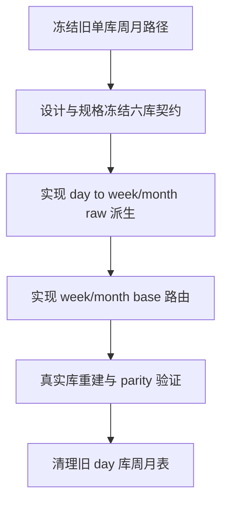

# raw/base 日周月分库迁移

卡片编号：`76`
日期：`2026-04-17`
状态：`草稿`

## 需求

- 问题：
  `75` 已在单库里引入 week/month 表族，但真实官方库显示这条路径没有稳定收口。当前 `stock week raw` 只完成 `5192 / 5509` 个 registry code、`5186` 个 weekly bar code，`stock month raw = 0`，`stock week base = 0`，`stock month base = 0`。`index / block` 周月完整，说明阻塞不在 schema 存在性，而在 stock 规模下的执行路径。
- 目标结果：
  把 `raw/base` 从“单库多 timeframe”正式迁成“day / week / month` 各自独立物理库”，其中：
  `day` 保持长期日更官方库；
  `week/month` 只作为从 `day` 官方库派生的独立账本；
  新六库校验通过后，删掉旧 day 库中的周月表和周月数据。
- 为什么现在做：
  当前 `H:\tdx_offline_Data` 只有 `*-day` 源，没有 `*-week / *-month` 源。继续在旧单库里从 txt 重扫周月，不仅慢，而且会把整个 `raw_market.duckdb / market_base.duckdb` 锁住，直接阻塞 data 模块作为系统基础库的长期可运行性。

## 设计输入

- 设计文档：
  `docs/01-design/modules/data/10-raw-base-day-week-month-ledger-split-charter-20260417.md`
  [10-raw-base-day-week-month-ledger-split-charter-20260417.md](/h:/lifespan-0.01/docs/01-design/modules/data/10-raw-base-day-week-month-ledger-split-charter-20260417.md)
- 规格文档：
  `docs/02-spec/modules/data/10-raw-base-day-week-month-ledger-split-spec-20260417.md`
  [10-raw-base-day-week-month-ledger-split-spec-20260417.md](/h:/lifespan-0.01/docs/02-spec/modules/data/10-raw-base-day-week-month-ledger-split-spec-20260417.md)
- 既有前置：
  [74-market-base-batched-bootstrap-governance-conclusion-20260416.md](/h:/lifespan-0.01/docs/03-execution/74-market-base-batched-bootstrap-governance-conclusion-20260416.md)
  [75-raw-base-weekly-monthly-timeframe-ledger-bootstrap-conclusion-20260416.md](/h:/lifespan-0.01/docs/03-execution/75-raw-base-weekly-monthly-timeframe-ledger-bootstrap-conclusion-20260416.md)

## 任务分解

1. 切片 1：冻结旧单库周月路径，补路径契约与 bootstrap，正式定义六库文件名和表族归属。
2. 切片 2：新增 `day raw -> week/month raw` 的 materialization runner，使周月不再回读 TDX txt。
3. 切片 3：改造 `run_market_base_build.py`，按 timeframe 路由到 day/week/month 对应 base 库。
4. 切片 4：补 unit test / migration validation，覆盖六库路径、聚合规则、旧 day 库 purge 边界。
5. 切片 5：在真实官方库完成 stock week/month 重建，形成 row/code/date parity 证据。
6. 切片 6：验证通过后清除旧 `raw_market.duckdb / market_base.duckdb` 中的周月表、周月 run 审计与周月 dirty 数据。

## 实现边界

- 范围内：
  `src/mlq/core/paths.py`
  `src/mlq/data/bootstrap.py`
  `src/mlq/data/data_raw_*`
  `src/mlq/data/data_market_base_*`
  `scripts/data/*`
  `tests/unit/data/*`
  `docs/01-design/modules/data/10-*`
  `docs/02-spec/modules/data/10-*`
  `docs/03-execution/76-*`
- 范围外：
  `malf / structure / filter / alpha` 消费层改造
  `78 -> 84` mainline middle-ledger 恢复实施
  把 objective/profile 再拆成独立数据库

## 历史账本约束

- 实体锚点：
  价格账本锚点继续是 `asset_type + code`；objective/profile 仍留在 day raw。
- 业务自然键：
  所有 price bar 仍是 `code + trade_date + adjust_method`；周月迁移只改变物理库归属，不改变业务自然键。
- 批量建仓：
  day 保持现有 bounded ingest/build；week/month 必须从 day 官方库按 `asset_type + timeframe + code batch` 分批重建。
- 增量更新：
  每日增量只更新 day raw/day base；week/month 通过 day ledger 的 checkpoint/digest 派生更新，不再读 txt。
- 断点续跑：
  day 继续沿用 `raw_ingest_run / raw_ingest_file / file_registry`；week/month 新增独立 materialization/build 审计表族并支持 checkpoint。
- 审计账本：
  六个官方库各自保存本 timeframe 的 run/scope/checkpoint/dirty 审计，不再让 week/month 与 day 共锁一库。

## 收口标准

1. 六库路径契约、bootstrap 与 runner 已正式落地。
2. `stock week raw/base` 与 `stock month raw/base` 已在新库完成全历史物化，并形成 parity 证据。
3. 旧 `raw_market.duckdb / market_base.duckdb` 中的周月 price 表、周月 run 审计和周月 dirty 数据已清除，day 库只保留 day 事实。
4. `evidence / record / conclusion` 已回填，当前待施工卡可再切回 `90`。

## 卡片结构图

