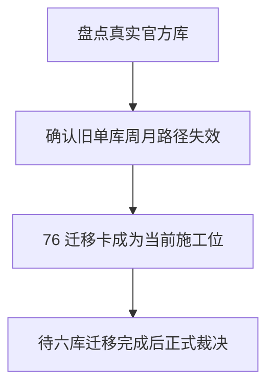

# raw/base 日周月分库迁移结论

结论编号：`76`
日期：`2026-04-17`
状态：`草稿`

## 裁决

- 接受：
  暂未接受，待 `76` 的六库迁移、真实库重建和旧 day 库周月清理全部完成后再正式裁决。
- 拒绝：
  拒绝继续把 `75` 的单库周月 txt 回补路径当作长期官方执行方案。

## 原因

- 真实官方库已经证明旧单库方案在 stock 规模下无法稳定收口：`stock week raw` 半成品、`stock week base` 和 `stock month raw/base` 均未完成。
- 现有离线源只有 day txt，没有任何 week/month txt；旧方案继续跑下去，只会反复从 txt 重扫周月并与 day 官方库争锁。

## 影响

- 当前正式待施工卡已切到 `76`，`80-86` 暂缓，等待 `data` 层六库分时框迁移完成后再恢复。
- 后续 week/month 的官方来源被重定义为“从 day 官方库派生”，不再是“从 txt 回退聚合写入同一物理库”。

## 结论结构图


## 2026-04-17 第一刀实现状态

- 已完成：
  - 六库路径契约已正式落到代码
  - day 兼容别名仍保留
  - raw/base 的 timeframe-aware bootstrap 入口已落地
  - `week/month` 独立库已经可以被正式 bootstrap 出来
- 尚未完成：
  - runner 仍主要落在旧 day 官方库
  - `day raw -> week/month raw` 派生链路尚未实现
  - 真实 `stock week/month` rebuild 与旧 day 库 purge 还未开始

## 当前裁决补充

- `76` 现在不再只是设计草稿，而是已经进入“代码第一刀落地、迁移未完成”的进行中状态。
- 下一刀应直接进入 runner 路由改造，而不是继续在旧单库方案上补跑 `stock week/month`。

## 本次验证

```text
pytest tests/unit/core/test_paths.py tests/unit/data/test_timeframe_ledger_bootstrap.py tests/unit/data/test_raw_ingest_runner.py -q
python scripts/system/check_doc_first_gating_governance.py
python scripts/system/check_development_governance.py
```

- 结果：`14 passed`，两项治理检查通过。

## 2026-04-17 第二刀补充裁决

- `76` 已从“只冻结路径契约”推进到“runner 已开始按 timeframe 写新库”的状态。
- 当前已成立的正式口径：
  - `day raw/base` 继续写旧 day 官方库
  - `week/month raw/base` 已开始写新 `week/month` 官方库
- 当前尚未成立的正式口径：
  - `week/month raw` 还不是从 `day raw` 正式派生，仍保留 day txt fallback
  - 真实官方库的 `stock week/month` rebuild 与旧 day 库 purge 还未执行

## 第二刀验证

```text
pytest tests/unit/core/test_paths.py tests/unit/data/test_timeframe_ledger_bootstrap.py tests/unit/data/test_raw_ingest_runner.py -q
python scripts/system/check_doc_first_gating_governance.py
python scripts/system/check_development_governance.py
```

- 结果：`16 passed`，两项治理检查通过。
## 2026-04-17 第三刀补充裁决

- `76` 已进一步推进到“`week/month raw` 的官方来源从 `day raw` 账本派生”的状态。
- 当前已经成立的正式口径：
  - `day raw` 仍是唯一读取 `H:\tdx_offline_Data` 日线 txt 的官方 raw 入口。
  - `week/month raw` 只允许读取 `raw_market_day.duckdb` 中对应 `asset + adjust_method` 的日线真值，再派生写入 `raw_market_week/month.duckdb`。
  - `week/month raw` 的 `resume / pending-only` 语义也已经改成基于 `day raw` 官方库盘点，而不是基于 `week/month txt` 目录盘点。
- 当前不再成立的旧口径：
  - `week/month raw` 从 `stock-week` / `stock-month` 直接源读取。
  - `week/month raw` 缺直接源时回退到 `day txt` 重扫聚合。
- 当前仍未完成：
  - 真实官方库上的 `stock week/month` rebuild。
  - rebuild 后的 parity 校验。
  - 旧 `day` 官方库里遗留周月表和数据的 purge。

## 第三刀验证

```text
pytest tests/unit/core/test_paths.py tests/unit/data/test_timeframe_ledger_bootstrap.py tests/unit/data/test_raw_ingest_runner.py tests/unit/data/test_market_base_timeframe_runner.py -q
python scripts/system/check_doc_first_gating_governance.py
python scripts/system/check_development_governance.py
```

- 结果：`19 passed`，两项治理检查通过。
