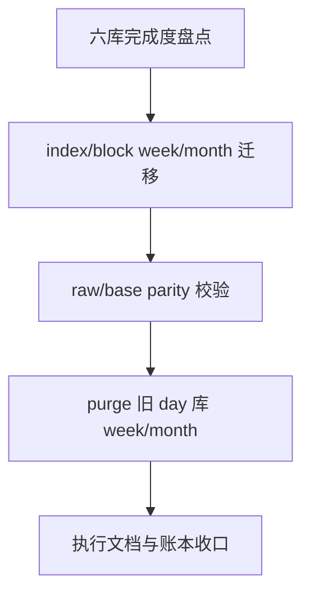

# raw/base 日周月分库迁移尾收口

卡片编号：`77`
日期：`2026-04-18`
状态：`草稿`

## 需求

- 问题：
  `76` 已把 `stock` 的 `week/month raw/base` 迁到新的 `week/month` 官方库，并确认 `day` 日线事实继续留在 `raw_market.duckdb / market_base.duckdb`。但真实库盘点显示，六库迁移还没有完整收口：
  - 新 `raw_market_week/month.duckdb` 与 `market_base_week/month.duckdb` 目前只完成了 `stock`
  - `index/block` 的 `week/month` 仍留在旧 `raw_market.duckdb / market_base.duckdb`
  - 旧 `day` 库里仍保留 `6` 张 `week/month` 价格表，且仍有历史数据
  - 这意味着当前官方库形态仍然是“day 库同时混存部分旧 week/month + 新 week/month 库只迁了 stock”，不满足 `76` 设计里“day 只保留 day，week/month 独立成库”的最终口径
- 目标结果：
  彻底收口 `raw/base` 六库迁移尾巴，使官方库口径变成：
  - `raw_market.duckdb / market_base.duckdb` 只保留 `day`
  - `raw_market_week.duckdb / market_base_week.duckdb` 承接 `stock/index/block week`
  - `raw_market_month.duckdb / market_base_month.duckdb` 承接 `stock/index/block month`
  - `stock/index/block × day/week/month × raw/base` 六库完成度全部闭环，并形成 parity 证据
- 为什么现在做：
  现在如果不把 `index/block` 迁完并 purge 旧 `day` 库里的 `week/month`，系统会长期处于“双口径并存”的危险状态：
  - 查询方无法仅凭物理库名判断正式真值
  - 后续 `78-84` 恢复时，mainline 可能误读 day 库里的旧 `week/month`
  - `76` 虽然在代码与 stock 实库上已经打通，但库资产形态还没有达到可长期维护的终态

## 设计输入

- 设计文档：
  `docs/01-design/modules/data/10-raw-base-day-week-month-ledger-split-charter-20260417.md`
  [10-raw-base-day-week-month-ledger-split-charter-20260417.md](/H:/lifespan-0.01/docs/01-design/modules/data/10-raw-base-day-week-month-ledger-split-charter-20260417.md)
- 规格文档：
  `docs/02-spec/modules/data/10-raw-base-day-week-month-ledger-split-spec-20260417.md`
  [10-raw-base-day-week-month-ledger-split-spec-20260417.md](/H:/lifespan-0.01/docs/02-spec/modules/data/10-raw-base-day-week-month-ledger-split-spec-20260417.md)
- 既有施工结论：
  [76-raw-base-day-week-month-ledger-split-migration-conclusion-20260417.md](/H:/lifespan-0.01/docs/03-execution/76-raw-base-day-week-month-ledger-split-migration-conclusion-20260417.md)
  [75-raw-base-weekly-monthly-timeframe-ledger-bootstrap-conclusion-20260416.md](/H:/lifespan-0.01/docs/03-execution/75-raw-base-weekly-monthly-timeframe-ledger-bootstrap-conclusion-20260416.md)

## 任务分解

1. 切片 1：盘点并冻结当前六库完成度矩阵，按 `asset_type × timeframe × raw/base` 标清 `已迁移 / 未迁移 / 待清理`
2. 切片 2：完成 `index/block week/month raw` 迁移到新 `raw_market_week/month.duckdb`
3. 切片 3：完成 `index/block week/month base` 迁移到新 `market_base_week/month.duckdb`
4. 切片 4：对 `stock/index/block week/month raw/base` 全部执行 row/code/date parity 校验，并固化为正式证据
5. 切片 5：清理旧 `raw_market.duckdb / market_base.duckdb` 中遗留的 `week/month` 价格表、相关 run 审计与 dirty 数据，只保留 day 官方事实
6. 切片 6：刷新 `76/77` 结论、完成度账本与阅读顺序，把当前 data 前置卡从“迁移中”推进到“六库收口完成”

## 实现边界

- 范围内：
  `src/mlq/data/bootstrap.py`
  `src/mlq/data/data_raw_*`
  `src/mlq/data/data_market_base_*`
  `scripts/data/run_tdx_asset_raw_ingest.py`
  `scripts/data/run_market_base_build.py`
  `tests/unit/data/*`
  `docs/03-execution/76-*`
  `docs/03-execution/77-*`
  `docs/03-execution/A-execution-reading-order-20260409.md`
  `docs/03-execution/B-card-catalog-20260409.md`
  `docs/03-execution/C-system-completion-ledger-20260409.md`
- 范围外：
  `malf / structure / filter / alpha` 的下游消费逻辑改造
  `78-84` mainline middle-ledger 恢复实现
  `objective/profile` 的独立分库设计

## 历史账本约束

- 实体锚点：
  价格账本锚点继续是 `asset_type + code`
- 业务自然键：
  所有 `raw/base` 价格表继续使用 `code + trade_date + adjust_method`
- 批量建仓：
  `week/month raw/base` 必须按 `asset_type + timeframe + code batch` 分批迁移，不允许整库全量重扫回归单 writer 长锁
- 增量更新：
  长期口径保持为“day 日更，week/month 从 day 官方账本派生”；`index/block` 迁移完成后也必须遵守同一口径
- 断点续跑：
  迁移过程必须保留 `run / scope / checkpoint / dirty` 审计，失败批次允许按 `pending-only / dirty-only` 恢复
- 审计账本：
  六个官方库各自保留本 timeframe 的 run 审计；旧 `day` 库 purge week/month 前必须先把尾巴 run 审计和 dirty 状态收干净

## 收口标准

1. 新 `raw_market_week/month.duckdb` 与 `market_base_week/month.duckdb` 已补齐 `stock/index/block`
2. `raw_market.duckdb / market_base.duckdb` 中旧 `week/month` 价格表、周月 run 审计和周月 dirty 数据已清理，只保留 day 官方事实
3. 六库完成度清单和 row/code/date parity 证据已补齐，能证明 `stock/index/block × day/week/month × raw/base` 全部对齐
4. `77` 的 `evidence / record / conclusion` 已回填，且执行索引、当前施工卡、系统完成账本和阅读顺序已同步

## 卡片结构图

