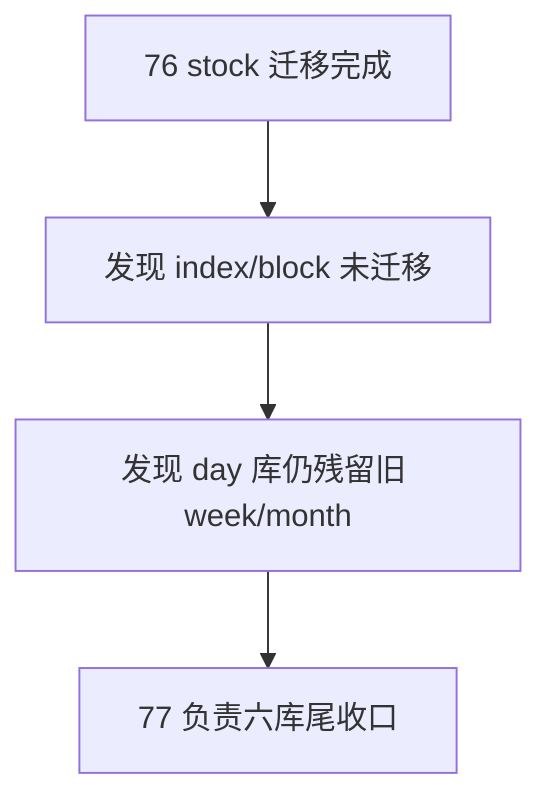

# raw/base 日周月分库迁移尾收口 结论

结论编号：`77`
日期：`2026-04-18`
状态：`草稿`

## 裁决

- 接受：
  暂未接受，待 `index/block week/month` 迁移到新 `week/month` 官方库、旧 `day` 库遗留 `week/month` 表族与审计被 purge，并形成六库完成度与 parity 证据后再正式接受
- 拒绝：
  拒绝把当前 `76` 的 stock-only 完成态误判成“六库迁移已经全部完成”

## 原因

- 当前真实库已经证明 `day` 官方事实完整，且 `stock week/month raw/base` 已完成，但 `index/block week/month` 仍留在旧 `day` 库，说明迁移还停留在部分完成态
- 旧 `raw_market.duckdb / market_base.duckdb` 仍保留 `6` 张 `week/month` 价格表，且仍承载历史数据；如果不 purge，就无法把“day 只保留 day”冻结成唯一正式库形态

## 影响

- 当前 data 前置卡从“六库迁移已能跑通 stock”推进到“六库资产形态彻底收口”的最后一锤
- `80-86` 继续等待 `77` 收口；只有 `index/block` 迁完并 purge 旧 day 库 week/month 后，mainline 才能在不带双口径歧义的前提下恢复

## 结论结构图

