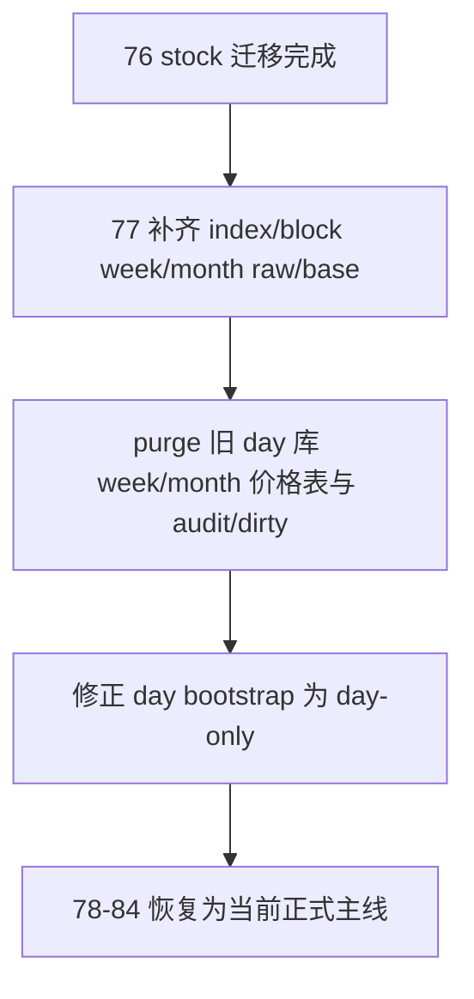

# raw/base 日周月分库迁移尾收口 结论

结论编号：`77`
日期：`2026-04-18`
状态：`接受`

## 裁决

- 接受：
  接受 `77` 收口结果：`index/block week/month raw/base` 已补齐到新 `week/month` 官方库，旧 `day` 库遗留 `week/month` 价格表与按 timeframe 挂在 day 库里的 audit / dirty 尾巴已 purge，且 day bootstrap 已收窄为只重建 `day + objective/profile` 表族
- 拒绝：
  拒绝继续把 `day` 官方库当成可混存 `week/month` 空表或历史尾巴的兼容库

## 原因

1. 六库完成度矩阵已闭环：
   - `raw day`：`stock 16,348,113 / index 377,711 / block 468,542`
   - `raw week`：`stock 3,453,967 / index 79,398 / block 98,719`
   - `raw month`：`stock 826,336 / index 18,774 / block 23,260`
   - `base day`：`stock 16,348,113 / index 377,711 / block 468,542`
   - `base week`：`stock 3,453,967 / index 79,398 / block 98,719`
   - `base month`：`stock 826,336 / index 18,774 / block 23,260`
2. `index/block week/month` 的 pending scope 已归零：
   - `index week/month = 100 existing / 0 pending`
   - `block week/month = 127 existing / 0 pending`
3. 旧 `raw_market.duckdb / market_base.duckdb` 中 `week/month` 价格表已不存在，`raw_ingest_* / *_file_registry / base_*` 只剩 `timeframe='day'` 行。
4. `77` 额外补了一刀 day bootstrap 边界修缮，避免后续 `bootstrap_raw_market_ledger()` 或 `bootstrap_market_base_ledger()` 再把 `week/month` 空表重建回 day 库。

## 影响

1. `76 -> 77` 的 data 前置迁移卡组已正式收口，`78-84` 可以恢复为当前正式主线施工位。
2. `day -> week/month` 的物理库语义现在可仅凭库名判断：
   - `raw_market.duckdb / market_base.duckdb` 只承载 `day`
   - `raw_market_week/month.duckdb / market_base_week/month.duckdb` 只承载对应 timeframe
3. 后续任何 `week/month` pending scope 盘点都不会再通过 day bootstrap 重建兼容空表污染 day 库。

## 结论结构图

