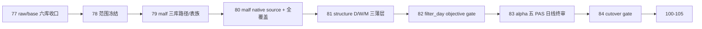

# malf alpha 双主轴重构范围冻结

`卡号`：`78`
`日期`：`2026-04-18`
`状态`：`待施工`

## 需求

- 问题：`raw/base` 已完成 `day/week/month` 分库，但当前 `78-84` 口径仍把 `malf` 写成单库多 timeframe，把 `structure` 写成单 day 出口，把 `filter` 写成职责未定的过渡层，也没有把 `malf` 全覆盖与 downstream bounded replay 的边界拆开。
- 目标结果：冻结新的 `malf -> structure -> filter -> alpha` 正式主链边界，明确：
  - `malf` 是 `day / week / month` 三库公共语义真值层，且必须全覆盖
  - `structure` 也跟随拆成 `day / week / month` 三个薄投影层
  - `filter` 保留一个 day 薄 gate 库，只做 objective gate + note sidecar
  - `alpha` 保留五个 PAS 日线终审库，不再为五个 trigger 各自再拆 `D/W/M`
- 为什么现在做：如果不先把这四条冻结清楚，`79-84` 就会一边做路径、一边改架构口径，最后每张卡都带半个设计决策。

## 设计输入

- 设计文档：`docs/01-design/modules/system/18-malf-alpha-dual-axis-and-timeframe-native-refactor-charter-20260418.md`
- 规格文档：`docs/02-spec/modules/system/18-malf-alpha-dual-axis-and-timeframe-native-refactor-spec-20260418.md`

## 任务分解

1. 冻结双主轴口径，确认 `malf` 是市场语义真值层，`alpha` 是决策真值层。
2. 冻结 `malf` 必须全覆盖，`79-83` 的 `2010 ~ 当前` bounded replay 只适用于 downstream，不适用于 `malf` 本体。
3. 冻结 `structure` 跟随 `malf` 拆成 `structure_day / structure_week / structure_month` 三个薄事实投影层。
4. 冻结 `filter` 保留一个 day 薄 gate 库，默认只消费 day 决策入口所需客观事实，不随 `malf` 再拆三库。
5. 冻结 `alpha` 按 `BOF / TST / PB / CPB / BPB` 五个 PAS 拆成五个日线官方库，并明确五个 trigger 不各自再拆 `D/W/M` 三套账本。
6. 把 `79-84` 切成一张卡只做一件事的顺序，并同步 `100-105` 的恢复前置条件。

## 实现边界

- 范围内：`78-84` 的模块主次关系、卡组顺序、`malf` 全覆盖例外、`filter` 的明确处理方案，以及 `alpha` 五库但不三套 trigger 库的边界。
- 范围外：本卡不直接改代码，不直接做 replay，不直接恢复 `100-105`。

## 历史账本约束

- 实体锚点：沿用 `asset_type + code` 为主锚点。
- 业务自然键：沿用各账本既有自然键；本卡只冻结主次关系与 replay 边界，不引入 `run_id` 业务主语义。
- 批量建仓：
  - `malf`：必须支持 `day / week / month` 三库全历史建仓并最终达成全覆盖
  - `structure / filter / alpha`：允许围绕 `2010-01-01` 至当前 official `market_base` 覆盖尾部做 bounded replay
- 增量更新：新口径下各模块继续由 queue/checkpoint 负责增量续跑，不允许回退成一次性全量脚本。
- 断点续跑：`malf` 三库、`structure` 三库、`filter_day` 与 `alpha` 五库都必须各自保留 checkpoint / replay 闭环。
- 审计账本：执行审计仍通过 `run / checkpoint / work_queue / summary_json + evidence / record / conclusion` 闭环。

## 收口标准

1. `78-84` 的职责顺序冻结清楚：
   - `79` 只做 `malf` 三库路径/表族契约
   - `80` 只做 `malf` timeframe native source + 全覆盖
   - `81` 只做 `structure` 三薄层
   - `82` 只做 `filter_day` 薄 gate
   - `83` 只做 `alpha` 五 PAS 日线终审重绑
   - `84` 只做 truthfulness / cutover gate
2. `malf` 全覆盖被写成明确例外，不再和 downstream 的 bounded replay 混写成一条。
3. `structure` 被正式冻结为 `D/W/M` 三薄层，而不是只保留 `malf_day` 单出口。
4. `filter` 的处理方案明确为“保留一个 day 薄 gate 库，只拦 objective gate，只附 note sidecar”。
5. `alpha` 五个 PAS 日线库写清楚，且明确“不为五个 trigger 再拆独立 `D/W/M` 三套账本”。
6. `100-105` 的恢复前置条件明确改为 `84` 接受。

## 卡片结构图

