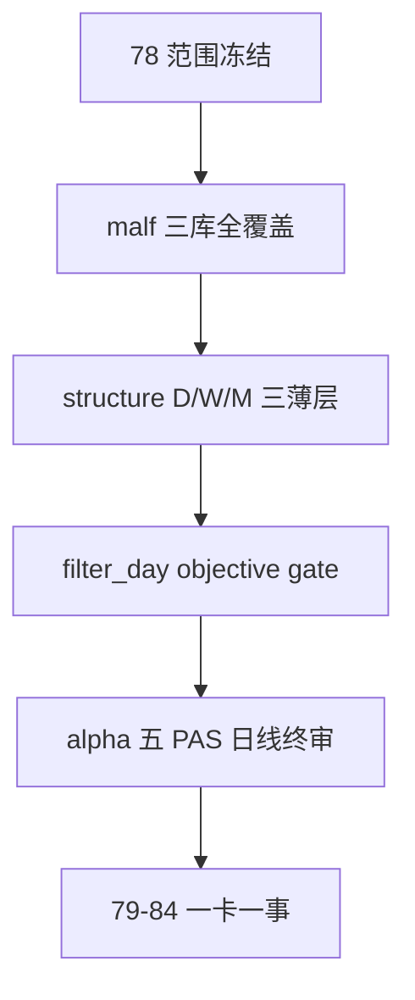

# malf alpha 双主轴重构范围冻结 结论

结论编号：`78`
日期：`2026-04-18`
状态：`接受`

## 裁决

- 接受：
  接受 `78` 范围冻结结果：`78-84` 正式改写为“`malf` 三库全覆盖、`structure` 三薄层、`filter_day` 客观 gate、`alpha` 五 PAS 日线终审、`84` 再决定 cutover”的新卡组。
- 拒绝：
  拒绝继续沿用旧口径：
  - `malf` 只做 `2010 ~ 当前` bounded replay 就算完成
  - `structure` 只保留单 `day` 出口
  - `filter` 继续悬空为“先不说到底保不保留本地库”
  - 五个 trigger 各自再拆独立 `D/W/M` 三套账本

## 原因

1. `malf` 是公共市场语义真值层，不是 downstream cutover sidecar；它必须全覆盖，不能被 `79-83` 的 bounded replay 口径吞掉。
2. 既然 `malf` 正式拆成 `day / week / month` 三库，`structure` 作为正式薄投影层也必须跟随拆成三层，否则周/月结构事实会失去稳定出口。
3. `filter` 的职责已经足够清楚：它服务的是日线决策入口，不需要再按 `D/W/M` 扩库，但必须保留一个稳定的 day 薄 gate ledger，把 objective gate 标准化给 `alpha` 消费。
4. 五个 trigger 属于 `alpha` 的日线决策视角，而不是新的 timeframe 公共真值层；它们可以读取周/月上下文，但不应再复制成 `5 × 3` 套正式账本。
5. 把这几件事先冻结后，`79-84` 才能真正做到“一张卡只做一件事”。

## 影响

1. `79-84` 的施工顺序被重排为：
   - `79`：`malf` 三库路径/表族
   - `80`：`malf` native source 与全覆盖
   - `81`：`structure_day / week / month`
   - `82`：`filter_day`
   - `83`：`alpha` 五 PAS 日线库
   - `84`：truthfulness / cutover
2. `malf` 与 downstream 的 replay 口径被正式拆开：
   - `malf` 必须全覆盖
   - `structure / filter / alpha` 可先做 `2010-01-01` 至当前 official `market_base` 覆盖尾部的 bounded replay
3. 当前待施工位在 `78` 收口后继续推进到 `79`，但 `79-84` 的内部边界已按新讨论口径重写。

## 结论结构图

