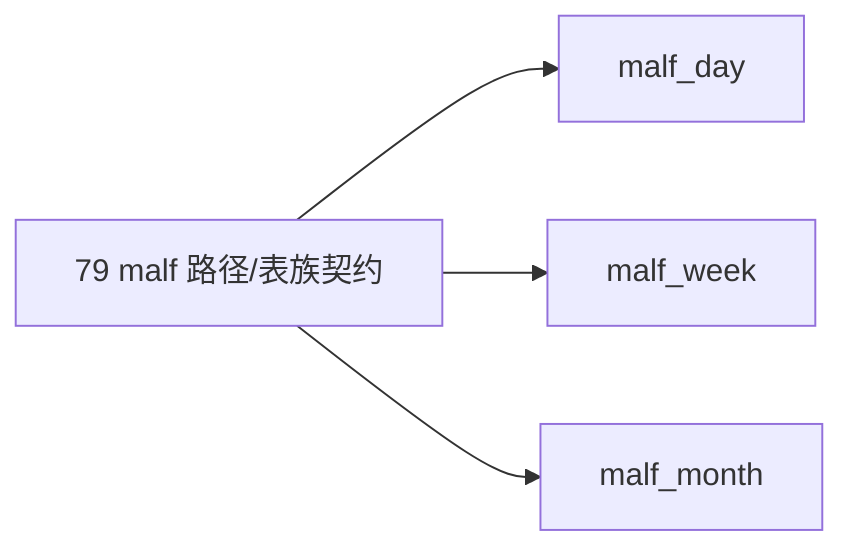

# malf 日周月分库路径与表族契约冻结

`卡号`：`79`
`日期`：`2026-04-18`
`状态`：`草稿`

## 需求

- 问题：`src/mlq/core/paths.py` 与 `malf bootstrap` 仍以单 `malf.duckdb` 为默认形态，无法承接 `malf_day / malf_week / malf_month` 的正式库契约。
- 目标结果：冻结 `malf_day / malf_week / malf_month` 三库的官方路径、bootstrap 契约与 canonical 表族边界。
- 为什么现在做：路径与表族不先冻住，`80` 的 source rebind 与全覆盖就没有稳定落点。

## 设计输入

- 设计文档：`docs/01-design/modules/system/18-malf-alpha-dual-axis-and-timeframe-native-refactor-charter-20260418.md`
- 规格文档：`docs/02-spec/modules/system/18-malf-alpha-dual-axis-and-timeframe-native-refactor-spec-20260418.md`

## 任务分解

1. 扩展 `WorkspaceRoots.databases`，新增 `malf_day / malf_week / malf_month` 正式路径。
2. 把 `bootstrap_malf_ledger` 与相关 helper 改成按 native timeframe 解析目标库。
3. 冻结三库 canonical 表族与每库单一 native timeframe 约束。
4. 明确单 `malf.duckdb` 不再是默认官方库，只保留兼容回退地位。
5. 补充路径解析与 bootstrap 单测。

## 实现边界

- 范围内：`malf` 三库路径、bootstrap、DDL、表族契约与测试。
- 范围外：
  - 本卡不改 `market_base -> malf` source 绑定
  - 本卡不做 `malf` 全覆盖 replay
  - 本卡不处理 `structure / filter / alpha` 的库切换

## 历史账本约束

- 实体锚点：`asset_type + code`。
- 业务自然键：`asset_type + code + native timeframe + bar_dt`。
- 批量建仓：三库必须都支持独立 bootstrap。
- 增量更新：每个库独立维护 queue/checkpoint。
- 断点续跑：`malf_canonical_work_queue / checkpoint` 必须按目标库各自闭环。
- 审计账本：每个库都保留 `malf_canonical_run / summary_json` 审计。

## 收口标准

1. 官方路径中出现 `malf_day / malf_week / malf_month`。
2. `bootstrap_malf_ledger` 能在三库上独立建表。
3. 三库 canonical 表族、native timeframe 单值约束与兼容回退边界写清。
4. 单库 `malf.duckdb` 不再被描述为默认官方库。
5. 测试覆盖路径解析与 bootstrap。

## 卡片结构图

