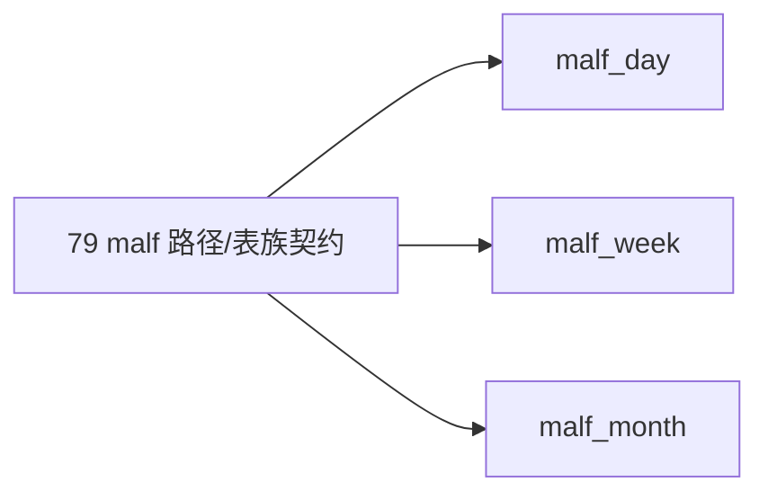

# malf 日周月分库路径与表族契约冻结

`卡号`：`79`
`日期`：`2026-04-18`
`状态`：`草稿`

## 需求

- 问题：`src/mlq/core/paths.py` 与 `malf bootstrap` 仍以单 `malf.duckdb` 为默认形态，无法承接 `malf_day / malf_week / malf_month` 的正式库契约。
- 目标结果：冻结 `malf_day / malf_week / malf_month` 三库的官方路径、bootstrap 契约与 canonical 表族边界。
- 为什么现在做：路径与表族不先冻住，`80` 的 source rebind 与全覆盖就没有稳定落点。

## 设计输入

- 设计文档：`docs/01-design/modules/system/18-malf-alpha-dual-axis-and-timeframe-native-refactor-charter-20260418.md`
- 规格文档：`docs/02-spec/modules/system/18-malf-alpha-dual-axis-and-timeframe-native-refactor-spec-20260418.md`

## 层级归属

- 主层：`malf`
- 次层：`core.paths / bootstrap / canonical DDL`
- 上游输入：`78` 已冻结的双主轴边界与 `market_base_day / week / month` 既有官方路径口径
- 下游放行：`80` 的 timeframe native source rebind，以及后续 `structure / filter / alpha` 对 `malf_*` 正式路径的绑定
- 本卡职责：把 `malf_day / malf_week / malf_month` 的物理路径、bootstrap 入口与 canonical 表族先冻结成稳定落点

## 任务分解

1. 扩展 `WorkspaceRoots.databases`，新增 `malf_day / malf_week / malf_month` 正式路径。
2. 把 `bootstrap_malf_ledger` 与相关 helper 改成按 native timeframe 解析目标库。
3. 冻结三库 canonical 表族与每库单一 native timeframe 约束。
4. 明确单 `malf.duckdb` 不再是默认官方库，只保留兼容回退地位。
5. 补充路径解析与 bootstrap 单测。

## 实现边界

- 范围内：`malf` 三库路径、bootstrap、DDL、表族契约与测试。
- 范围外：
  - 本卡不改 `market_base -> malf` source 绑定
  - 本卡不做 `malf` 全覆盖 replay
  - 本卡不处理 `structure / filter / alpha` 的库切换

## 历史账本约束

- 实体锚点：`asset_type + code`。
- 业务自然键：`asset_type + code + native timeframe + bar_dt`。
- 批量建仓：三库必须都支持独立 bootstrap。
- 增量更新：每个库独立维护 queue/checkpoint。
- 断点续跑：`malf_canonical_work_queue / checkpoint` 必须按目标库各自闭环。
- 审计账本：每个库都保留 `malf_canonical_run / summary_json` 审计。

## 正式设计清单

| 设计项 | 正式口径 | 不接受情形 |
| --- | --- | --- |
| 官方路径 | `WorkspaceRoots.databases` 正式暴露 `malf_day / malf_week / malf_month` | 继续只暴露单 `malf.duckdb` |
| bootstrap 解析 | `bootstrap_malf_ledger` 按 native timeframe 解析目标库并独立建表 | 靠运行参数临时改写或跨库串接 |
| canonical 表族 | 三库共享 canonical 表族语义，但各自只承载单一 native timeframe | 单库继续混 `D/W/M`，或三库表族语义不一致 |
| timeframe 单值约束 | 每个库必须有明确单值 timeframe 约束 | 同一库继续落混合 timeframe 数据 |
| 兼容回退 | 单 `malf.duckdb` 仅保留兼容/回退角色，不再是默认官方库 | 文档或代码仍把单库视为主真值落点 |
| 下游交接 | `80-84` 默认只接 `malf_day / week / month` 官方路径 | downstream 继续从旧单库或 bridge 路径取数 |

## 实施清单

| 切片 | 实施内容 | 交付物 |
| --- | --- | --- |
| 切片 1 | 扩展 `WorkspaceRoots.databases` 与路径常量，补三库正式路径 | 路径定义 |
| 切片 2 | 改 `bootstrap_malf_ledger` 与 helper，支持按 native timeframe 建库建表 | bootstrap 逻辑 |
| 切片 3 | 冻结 canonical 表族、单值 timeframe 约束与兼容回退边界 | DDL/契约说明 |
| 切片 4 | 补路径解析与 bootstrap 单测 | tests |
| 切片 5 | 回填 `79` 对应 evidence / record / conclusion 与索引 | execution 闭环 |

## A 级判定表

| 判定项 | A 级通过标准 | 阻断条件 | 对下游影响 |
| --- | --- | --- | --- |
| 三库路径 | `malf_day / week / month` 官方路径明确存在 | 路径仍只有单库或命名不稳定 | `80` 无稳定落点 |
| bootstrap 建仓 | 三库都能独立 bootstrap canonical 表族 | 只能先建单库再拆分 | `79` 不成立 |
| 单值 timeframe | 每库 native timeframe 约束稳定落地 | 同库可混 `D/W/M` | `80/81` 读取语义不可信 |
| 兼容边界 | 单库 `malf.duckdb` 只保留回退地位 | 默认口径仍指向单库 | 后续 authority 回滚 |
| 测试覆盖 | 路径解析与 bootstrap 有单测或等价证据 | 只有口头裁决无验证 | 卡不可收口 |

## 收口标准

1. 官方路径中出现 `malf_day / malf_week / malf_month`。
2. `bootstrap_malf_ledger` 能在三库上独立建表。
3. 三库 canonical 表族、native timeframe 单值约束与兼容回退边界写清。
4. 单库 `malf.duckdb` 不再被描述为默认官方库。
5. 测试覆盖路径解析与 bootstrap。

## 卡片结构图

