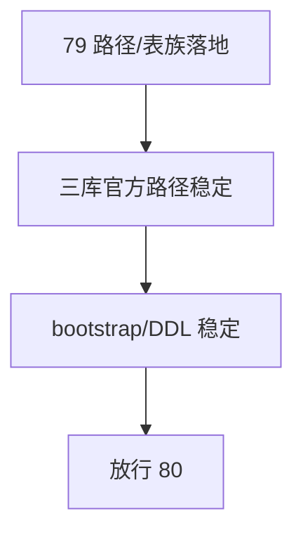

# malf 日周月分库路径与表族契约冻结 结论

结论编号：`79`
日期：`2026-04-18`
状态：`草稿`

## 预设裁决

- 接受：
  当 `malf_day / malf_week / malf_month` 成为唯一默认官方路径，且 bootstrap/DDL 已按三库 native timeframe 契约稳定落地时接受。
- 拒绝：
  如果实现仍以单 `malf.duckdb` 为默认官方库，或三库表族/DDL 仍需依赖单库兼容预建，则拒绝。

## 预设原因

1. `80` 的 native source 与全覆盖必须建立在稳定的三库路径与表族之上。
2. `79` 只负责 `malf` 自身路径契约，不承担 replay 或 downstream 切换职责。

## 预设影响

1. `80` 可以直接围绕三库做 source rebind 与全覆盖。
2. `81-83` 不再需要猜测 `malf` 的官方落库目标。

## 结论结构图

