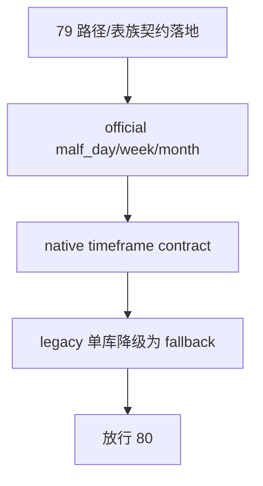

# malf 日周月分库路径与表族契约冻结 结论

`结论编号`：`79`
`日期`：`2026-04-18`
`状态`：`接受`

## 裁决

- 接受：`WorkspaceRoots.databases` 已正式暴露 `malf_day / malf_week / malf_month` 三库路径，并把单 `malf.duckdb` 降为 `legacy fallback`。
- 接受：`bootstrap_malf_ledger` 已显式区分 official native 与 legacy compat 两种模式；official native 会冻结 `malf_ledger_contract`，并对带 `timeframe` 的表族加单值约束。
- 接受：仍依赖单库的 `malf snapshot / canonical / mechanism / wave_life` runner 已显式标记为 `use_legacy=True`，避免把 legacy 路径继续伪装成官方默认库。
- 拒绝：继续把 `malf.duckdb` 当作默认官方库，或让三库 bootstrap 仍依赖单库预建。

## 原因

1. 新 `80` 的 `0/1` 波段过滤边界与新 `81` 的 timeframe native source rebind，都需要先有稳定的三库落点，否则过滤语义、source 绑定和表族边界会一起漂移。
2. `79` 的职责是先冻结路径、bootstrap 与 native timeframe 约束，不提前偷做 `80` 的过滤裁决，也不提前偷做 `81` 的 source rebind 或全覆盖收口。
3. 把 legacy 单库显式标成兼容回退位，后续 `82-84` 才不会误把旧路径当成正式真值层。
4. 既然官方真值层已经固定为 `malf_day / malf_week / malf_month`，那后续 `0/1` 审计、算法修订与可能的三库重建，也都必须围绕这三库执行，不能再退回单库混跑。

## 影响

1. 新 `80` 现在可以围绕 `malf_day / malf_week / malf_month` 冻结 `0/1` 波段过滤边界，新 `81` 再围绕同一组三库做 source rebind 与全覆盖。
2. `82-84` 现在有稳定的 official path contract，可直接按三库契约绑定 downstream。
3. `scripts/malf/run_malf_zero_one_wave_audit.py` 这类只读审计脚本，也必须以 `malf_day / malf_week / malf_month` 为唯一官方输入，不得再从 legacy 单库拼接基线。
4. 当前正式待施工卡从 `79` 推进到 `80-malf-zero-one-wave-filter-boundary-freeze-card-20260418.md`。

## 证据

1. `tests/unit/malf/test_bootstrap_path_contract.py`
2. `python -m pytest tests/unit/malf/test_bootstrap_path_contract.py tests/unit/malf/test_malf_runner.py tests/unit/malf/test_mechanism_runner.py tests/unit/malf/test_wave_life_runner.py tests/unit/malf/test_wave_life_explicit_queue_mode.py -q`
3. `python -m pytest tests/unit/structure/test_runner.py tests/unit/filter/test_runner.py tests/unit/alpha/test_pas_runner.py -q`

## 结论结构图

