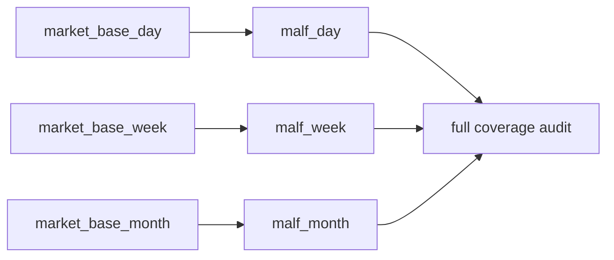

# malf timeframe native base source 重绑与全覆盖收口

`卡号`：`80`
`日期`：`2026-04-18`
`状态`：`草稿`

## 需求

- 问题：当前 `malf` 的 `W/M` 仍在内部从日线重采样，而不是直接消费 `market_base_week/month`；同时旧口径把 `malf` 也塞进 `2010 ~ 当前` bounded replay，和它作为公共真值层的职责冲突。
- 目标结果：`malf_day / week / month` 分别直接从 `market_base_day / week / month` 构建 canonical 账本，并完成三库全覆盖收口。
- 为什么现在做：如果 `80` 不把 `malf` 全覆盖做完，后面的 `81-84` 无论 replay 多漂亮，基座仍然不是正式真值层。

## 设计输入

- 设计文档：`docs/01-design/modules/system/18-malf-alpha-dual-axis-and-timeframe-native-refactor-charter-20260418.md`
- 规格文档：`docs/02-spec/modules/system/18-malf-alpha-dual-axis-and-timeframe-native-refactor-spec-20260418.md`

## 任务分解

1. 改 `run_malf_canonical_build` 与 `canonical_runner`，按 native timeframe 选择对应 `market_base_*` 和 `malf_*`。
2. 删除 `malf` 内部对 `W/M` 的日线 resample 默认路径，只保留必要兼容检查。
3. 用批次/child run/queue/checkpoint 完成 `malf_day / week / month` 三库全历史构建。
4. 输出 `D/W/M` 三库全覆盖 row/scope/date-range 审计摘要。

## 实现边界

- 范围内：`malf canonical runner/source/materialization` 的 timeframe native source 契约与全覆盖收口。
- 范围外：
  - 本卡不做 `structure / filter / alpha` 重绑
  - 本卡不重写 `market_base`
  - 本卡不接受“只做 `2010 ~ 当前` tail replay 就算 `malf` 完成”

## 历史账本约束

- 实体锚点：`asset_type + code`。
- 业务自然键：沿用 canonical `pivot / wave / snapshot` 既有自然键，库间只按 native timeframe 分隔。
- 批量建仓：必须支持三库全历史建仓，可分批执行，但收口标准是全覆盖。
- 增量更新：`D/W/M` 各自沿用 queue/checkpoint 增量追平。
- 断点续跑：任一 timeframe 全覆盖构建中断后必须能从对应库独立恢复。
- 审计账本：三库都要有 `run / work_queue / checkpoint / summary_json` 摘要。

## 收口标准

1. `malf_week/month` 的 source 不再来自 `day` 内部 resample。
2. `malf_day / week / month` 三库都完成全覆盖，不接受“只做 `2010 ~ 当前` bounded replay”作为本卡收口。
3. 单测覆盖 source 选择与周月 native build。
4. 证据中明确给出三库全覆盖的 row/scope/date-range 摘要。

## 卡片结构图

