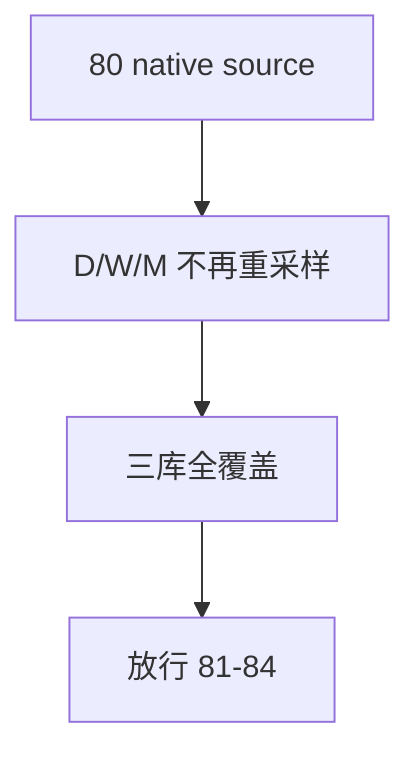

# malf timeframe native base source 重绑与全覆盖收口 结论

结论编号：`80`
日期：`2026-04-18`
状态：`草稿`

## 预设裁决

- 接受：
  当 `malf_day / week / month` 全部直接消费各自 `market_base_*`，且三库都完成全覆盖收口时接受。
- 拒绝：
  如果实现仍依赖日线重采样周/月，或仅完成 `2010 ~ 当前` tail replay 就宣称 `malf` 已切库，则拒绝。

## 预设原因

1. `malf` 是公共语义真值层，必须全覆盖。
2. `79-83` 的 bounded replay 只适用于 downstream cutover，不适用于 `malf`。

## 预设影响

1. `81-84` 可在稳定的 `malf_day / week / month` 真值层上推进。
2. `84` 可以明确审计“`malf` 已全覆盖，downstream 已 bounded replay”两类不同完成度。

## 结论结构图

