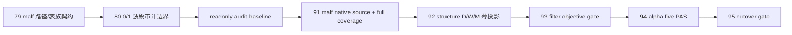

# malf 0/1 波段过滤边界冻结

`卡号`：`80`
`日期`：`2026-04-18`
`状态`：`接受`

## 需求

- 问题：当前 canonical `malf_wave_ledger` 在 `D/W/M` 三个级别都大量出现 `bar_count in {0,1}` 的已完成 wave；如果不先把“怎么审计、在哪里过滤、过滤后如何回指 canonical 原始 wave”冻结清楚，`structure / filter / alpha` 会各自长出私有口径。
- 目标结果：把 `0/1` 波段问题从零散讨论升级为独立治理卡位，先冻结 `canonical truth` 与 `filtered consumption` 的分层边界，并固定一份统一的只读审计脚本，供后续算法修订和三库重建前后对照。
- 为什么现在做：`0/1` 问题已经是 `malf` 核心 truthfulness 障碍；如果等 `92-95` 再由 downstream 各自补丁处理，`95` 的 cutover gate 将失去统一审计基线。

## 设计输入

- 设计文档：`docs/01-design/modules/system/18-malf-alpha-dual-axis-and-timeframe-native-refactor-charter-20260418.md`
- 规格文档：`docs/02-spec/modules/system/18-malf-alpha-dual-axis-and-timeframe-native-refactor-spec-20260418.md`

## 层级归属

- 主层：`malf`
- 次层：`canonical wave ledger / filtered read model / readonly audit baseline`
- 上游输入：`79` 已冻结的 `malf_day / malf_week / malf_month` 官方路径与表族契约，以及当前 official ledger 上的 `0/1` 统计现象
- 下游放行：`91` 的 native source/full coverage 收口，以及 `92-95` 对 `malf` 的正式消费与 cutover 审计
- 本卡职责：冻结 `0/1` 波段问题的观察口径、truth/filter 分层、统一审计入口与 potential rebuild 的前后对照合同

## 任务分解

1. 冻结 `0/1` 波段的正式观察口径：默认只面向 `active_flag = FALSE` 的完成 wave，并分别统计 `bar_count = 0` 与 `bar_count = 1`。
2. 冻结 official truth 边界：`malf_wave_ledger / malf_state_snapshot` 在 dedicated 过滤方案落地前保留 canonical 原始事实，不允许静默删改历史短 wave。
3. 冻结 filtered consumption 边界：后续如需“过滤后的结构读取口径”，只能通过只读派生层、sidecar 或显式 filtered projection 提供，并必须保留回指原始 `wave_id` 的能力。
4. 固化统一只读审计入口：新增 `scripts/malf/run_malf_zero_one_wave_audit.py`，统一把短 wave 标成 `same_bar_double_switch / stale_guard_trigger / next_bar_reflip` 三类。
5. 冻结 rebuild 对照合同：任何 `canonical_materialization` 行为改写、`0/1` 消费合同调整或 `malf_day / malf_week / malf_month` 重建，都必须保留审计脚本的变更前基线与变更后对照。
6. 回填入口文件、设计/规格、evidence/record/conclusion，使 `80` 成为后续 `91-95` 的正式前置关口。

## 实现边界

- 范围内：
  - `0/1` 波段观察口径
  - `truth layer` 与 `filtered layer` 的分层合同
  - `run_malf_zero_one_wave_audit.py` 只读审计入口
  - 变更前/后审计基线与 possible rebuild 的治理约束
- 范围外：
  - 本卡不直接改写 `canonical_materialization` 的结构判定逻辑
  - 本卡不直接重建任意正式 `malf` 历史账本
  - 本卡不提前替 `structure / filter / alpha` 实现下游消费层

## 历史账本约束

- 实体锚点：沿用 `asset_type + code`
- 业务自然键：沿用 canonical `wave_id / timeframe / start_bar_dt` 等既有自然键；若派生 filtered 层，必须保留回指原始 `wave_id`
- 批量建仓：审计脚本必须支持一次性覆盖 `malf_day / malf_week / malf_month` 全历史完成短 wave
- 增量更新：若后续形成持久化 filtered 输出，必须显式声明如何跟随 canonical queue/checkpoint 增量续跑
- 断点续跑：当前只读审计脚本不写 checkpoint；若后续落成持久化层，必须显式声明 replay/checkpoint 合同
- 审计账本：本卡先冻结只读审计入口；若后续新增过滤输出，必须补齐对应 `run / summary / evidence / record / conclusion`

## 正式设计清单

| 设计项 | 正式口径 | 不接受情形 |
| --- | --- | --- |
| truth layer | official canonical `malf` 继续保留原始 `0/1` wave 事实 | 在没有专门裁决前直接删改 `malf_wave_ledger` |
| filtered layer | 若需要过滤，只能通过只读派生层、sidecar 或 filtered projection 提供 | downstream 各自实现一套私有过滤 |
| 审计入口 | `scripts/malf/run_malf_zero_one_wave_audit.py` 是统一只读审计基线 | 每个模块各跑各的临时 SQL |
| 分类合同 | 短 wave 统一标成 `same_bar_double_switch / stale_guard_trigger / next_bar_reflip` | 口径漂移或分类不能回指原始 wave |
| 重建边界 | 任何 `malf_day / week / month` 重建都必须保留变更前/后同口径审计对照 | 改完再看结果，缺失变更前基线 |
| downstream authority | `91-95` 只允许消费本卡冻结的统一合同 | `structure/filter/alpha` 私自加 `0/1` 过滤硬规则 |

## 实施清单

| 切片 | 实施内容 | 交付物 |
| --- | --- | --- |
| 切片 1 | 固化 `0/1` 波段三类分类合同与只读审计实现 | `src/mlq/malf/zero_one_wave_audit.py` |
| 切片 2 | 新增 CLI 审计入口并纳入正式入口清单 | `scripts/malf/run_malf_zero_one_wave_audit.py` / `README.md` / `AGENTS.md` / `pyproject.toml` |
| 切片 3 | 覆盖三类分类、导出产物与三库路径约束的单测 | `tests/unit/malf/test_zero_one_wave_audit.py` |
| 切片 4 | 回填 `79/80` 设计、规格、card、conclusion 合同 | execution/doc bundle |
| 切片 5 | 运行治理检查与目标验证，形成 evidence / record | execution evidence / record |

## A 级判定表

| 判定项 | A 级通过标准 | 阻断条件 | 对下游影响 |
| --- | --- | --- | --- |
| 独立成卡 | `0/1` 问题拥有独立正式卡位 `80` | 继续散落在 `91-95` | downstream authority 漂移 |
| truth/filter 分层 | canonical truth 与过滤消费层边界写清 | 在 core 中静默过滤 | truthfulness 失真 |
| 审计统一 | 审计脚本能统一给三库短 wave 打标签并导出结果 | 仍靠临时 SQL 或样本口述 | 重建前后不可对照 |
| 三库绑定 | 审计入口只读取 `malf_day / week / month` | 回退单库混跑 | `79` 路径契约被绕过 |
| 重建基线 | 任何算法改写或三库重建都有变更前/后同口径审计 | 缺失前态基线 | `95` 无法做 cutover 审计 |

## 收口标准

1. `80` 被正式定义为 `malf 0/1 wave` 独立治理卡位。
2. official canonical `malf` 在 dedicated 过滤方案落地前继续保留原始短 wave 事实。
3. `scripts/malf/run_malf_zero_one_wave_audit.py` 成为统一只读审计入口，并完成三类分类与导出合同。
4. `README / AGENTS / pyproject / design / spec` 全部同步到新合同。
5. 任意后续 `canonical_materialization` 改动或 `malf_day / malf_week / malf_month` 重建，都必须以本卡审计脚本保留变更前/后的同口径结果。

## 卡片结构图

