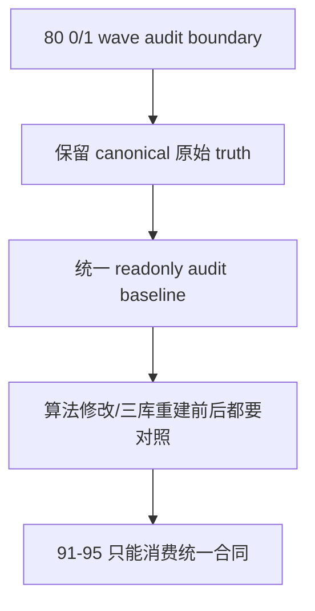

# malf 0/1 波段过滤边界冻结 结论

`结论编号`：`80`
`日期`：`2026-04-19`
`状态`：`接受`

## 裁决

- 接受：`0/1` 波段问题必须拥有独立正式卡位，不再允许散落进 `91-95` 的 downstream 卡面中各自补丁处理。
- 接受：在 dedicated 过滤方案真正落地前，official canonical `malf_wave_ledger / malf_state_snapshot` 继续保留原始 `0/1` wave 事实，不允许静默删改历史账本。
- 接受：后续若需要“过滤后的结构读取口径”，只能通过只读派生层、sidecar 或显式 filtered projection 提供，并且必须可回指原始 `wave_id`。
- 接受：`scripts/malf/run_malf_zero_one_wave_audit.py` 成为 `80` 冻结的统一只读审计入口；它只允许读取 `malf_day / malf_week / malf_month`，并把完成的短 wave 标成 `same_bar_double_switch / stale_guard_trigger / next_bar_reflip` 三类。
- 接受：任何 `canonical_materialization` 行为改写、`0/1` 消费合同调整或 `malf_day / malf_week / malf_month` 重建，都必须保留 `run_malf_zero_one_wave_audit.py` 的变更前基线与变更后对照。
- 拒绝：继续让 `structure / filter / alpha` 各自私带 `0/1` 过滤规则，或在未冻结统一审计合同前直接重算 `malf core`。

## 原因

1. `0/1` 短 wave 已经不是个别样本噪声，而是 `malf` 在 `D/W/M` 上共同暴露的系统性现象；如果不先固化统一审计口径，后续每张 downstream 卡都会夹带自己的解释。
2. “过滤 `0/1`” 改变的不是展示细节，而是正式消费合同；如果直接写回 canonical truth，`95` 的 truthfulness / cutover gate 会失去可追溯基线。
3. `79` 已经把官方真值层固定为 `malf_day / malf_week / malf_month` 三库，因此后续审计、算法修订与 potential rebuild 也必须围绕这三库展开，不能再退回单库混跑。
4. 先冻结只读审计入口，再讨论是否修 `switch_mode`、重算 `bar_count` 或截断 stale guard 复用链，才能保证每一种修法都有同口径的前后对照。

## 影响

1. `80` 不再只是编号调整，而是 `0/1` 问题的统一审计与分层边界；`91-95` 只能消费这份合同，不能各自补丁。
2. `scripts/malf/run_malf_zero_one_wave_audit.py` 被纳入正式入口文件与治理清单，成为 `malf` 三库重建前后的默认对照工具。
3. 后续若真的要重建 `malf_day / malf_week / malf_month`，必须至少保留：
   - 一版变更前 audit summary / report / detail
   - 一版变更后 audit summary / report / detail
4. 当前正式待施工位仍是 `92-structure-thin-projection-and-day-binding-card-20260418.md`；`100-105` 仍需等待 `95` 通过后才恢复。

## 证据

1. `tests/unit/malf/test_zero_one_wave_audit.py`
2. `python -m pytest tests/unit/malf/test_zero_one_wave_audit.py -q`
3. `python scripts/malf/run_malf_zero_one_wave_audit.py --timeframes D W M --sample-limit 5 --summary-path H:/Lifespan-report/malf/zero-one-wave-audit/summary.json --report-path H:/Lifespan-report/malf/zero-one-wave-audit/report.md --detail-path H:/Lifespan-report/malf/zero-one-wave-audit/detail.csv`
4. `python .codex/skills/lifespan-execution-discipline/scripts/check_execution_indexes.py --include-untracked`
5. `python scripts/system/check_doc_first_gating_governance.py`
6. `python scripts/system/check_development_governance.py`

## 结论结构图

