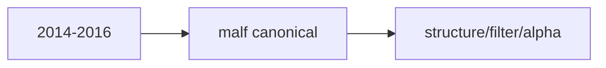

# mainline middle-ledger 2014-2016 bootstrap 卡
`卡号`：`81`
`日期`：`2026-04-14`
`状态`：`待施工`

## 需求

- 问题：正式 middle-ledger 初始建设需要继续按三年窗口向前推进。
- 目标结果：完成 `2014-01-01 ~ 2016-12-31` 的中间库建库。
- 为什么现在做：这是第二段三年窗口，承接 `80` 后续扩建。

## 设计输入

- 设计文档：`docs/01-design/modules/system/17-official-middle-ledger-phased-bootstrap-and-real-data-pilot-charter-20260414.md`
- 规格文档：`docs/02-spec/modules/system/17-official-middle-ledger-phased-bootstrap-and-real-data-pilot-spec-20260414.md`

## 任务分解

1. 完成 `2014-2016` 的 canonical `malf` 建库。
2. 完成 `2014-2016` 的 downstream 重跑。
3. 汇总窗口级正式读数并收口。

## 实现边界

- 范围内：`2014-2016` 中间库建库。
- 范围外：其他年份窗口与执行侧恢复。

## 历史账本约束

- 实体锚点：沿用正式实体锚点。
- 业务自然键：沿用正式自然键。
- 批量建仓：本卡仅覆盖 `2014-01-01 ~ 2016-12-31`。
- 增量更新：增量对齐仍由 `65` 负责，本卡只补建历史窗口。
- 断点续跑：继续服从正式 queue/checkpoint/replay。
- 审计账本：正式 run summary 与 execution evidence / record / conclusion 共同审计。

## 收口标准

1. `2014-2016` 建库完成。
2. canonical/downstream 默认输入无回退。
3. 证据、记录、结论闭环。
4. 为 `62` 提供可复验窗口边界。

## 卡片结构图

