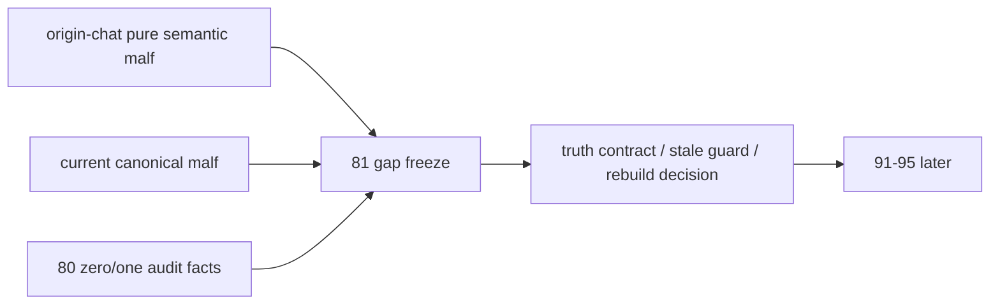

# malf 原始对话语义与当前真值偏差冻结

`卡号`：`81`
`日期`：`2026-04-19`
`状态`：`草稿`

## 需求

- 问题：`malf` 最初成型于一段长对话，但当前系统里缺少一张正式执行卡，去冻结“聊天里最终成型的 `malf` 到底是什么”、“当前系统 `malf` 与那套语义到底差多远”、“修 `malf` 时应先修哪一层”。
- 目标结果：把 origin-chat `malf` 语义锚点、当前 canonical truth gap 与后续修订顺序冻结成独立正式卡位，作为彻底解决 `malf` 的前置关口。
- 为什么现在做：`80` 的审计已经证明 `0/1 wave` 是 canonical truth 的系统性偏差；如果不先冻结 origin-chat 语义与当前偏差矩阵，后续一切 `malf` 修订都会在“到底要对齐哪一版 `malf`”上继续漂。

## 设计输入

- 设计文档：`docs/01-design/modules/malf/16-malf-origin-chat-semantic-reconciliation-charter-20260419.md`
- 规格文档：`docs/02-spec/modules/malf/16-malf-origin-chat-semantic-reconciliation-spec-20260419.md`
- 当前权威总设计：`docs/01-design/modules/malf/15-malf-authoritative-timeframe-native-ledger-charter-20260419.md`
- 当前权威总规格：`docs/02-spec/modules/malf/15-malf-authoritative-timeframe-native-ledger-spec-20260419.md`
- 审计前置事实：`docs/03-execution/80-malf-zero-one-wave-filter-boundary-freeze-conclusion-20260418.md`

## 层级归属

- 主层：`malf`
- 次层：`origin semantic anchor / truth gap / rebuild gate`
- 上游输入：origin-chat 最终纯语义 `malf`、当前官方 `malf_day / week / month`、`80` 的 `0/1` 审计基线
- 下游放行：`91-95` 的 downstream cutover 恢复
- 本卡职责：冻结“回顾历史、珍惜现在、走向未来”的正式桥梁，不直接改算法，而是先把 origin、现状与未来顺序钉死

## 任务分解

1. 明确 origin-chat `malf` 哪一版才是当前正式对齐对象。
2. 冻结当前系统 `malf` 与 origin-chat 语义的继承矩阵与偏差矩阵。
3. 基于 `80` 的全量统计，把 `0/1 wave` 定性为 truthfulness 偏差，而不是 downstream 消费口径问题。
4. 冻结 `break / invalidation / confirmation`、stale guard 与 rebuild 的后续顺序。
5. 在 `81` 未收口前，把 `91-95` 从“当前最近施工位”退回为远置后续卡组。
6. 明确回答“当前系统 `malf` 和聊天里的 `malf` 是否有巨大差异”时，必须区分：
   - 对早期重型版：差异大
   - 对最终纯语义版：架构同轴但 truthfulness 偏差大

## 实现边界

- 范围内：
  - origin-chat 语义锚点裁决
  - 当前 truth gap 裁决
  - 后续修订顺序与暂停边界
- 范围外：
  - 本卡不直接修改 `canonical_materialization.py`
  - 本卡不直接重建 `malf_day / malf_week / malf_month`
  - 本卡不直接推进 `92-95`

## 历史账本约束

- 实体锚点：`asset_type + code`
- 业务自然键：沿用 canonical `pivot / wave / snapshot` 自然键，不新增 run 级临时主语义
- 批量建仓：若后续决定 rebuild，必须以三库 full coverage 为目标，不允许退回局部样本
- 增量更新：本卡只冻结顺序，不改 queue/checkpoint 合同
- 断点续跑：若后续 rebuild 发生，中断后仍必须按各 timeframe 库独立恢复
- 审计账本：后续任何 `malf` 修订都必须保留 `80` 审计脚本的变更前/后基线

## 正式设计清单

| 设计项 | 正式口径 | 不接受情形 |
| --- | --- | --- |
| origin 分层 | 必须区分早期重型版与最终纯语义版 | 把整段聊天混成单一版本 |
| origin 对齐对象 | 以聊天里最后收敛的“纯语义版 malf”为正式对齐对象 | 回退到最早那版 execution-interface-heavy malf |
| 当前架构判断 | 当前系统 `malf` 与 origin-chat 最终版主轴一致 | 把当前系统简单定性成“完全不是那套 malf” |
| 当前 truth 判断 | 当前 canonical truth 与 origin-chat 最终版存在重大偏差 | 把 `0/1` 问题降格为下游过滤习惯 |
| 关键直觉继承 | 必须保留“`LL/HH` 管推进、最近 `LH/HL` 管最后门槛、break 先于确认”的 origin 直觉 | 只保留抽象术语，不保留关键交易语义 |
| `0/1` 定性 | `0/1 wave` 是 truthfulness 问题 | 继续让 `structure/filter/alpha` 各自兜底 |
| 暂停边界 | `81` 未收口前，`91-95` 只保留为远置后续卡组 | 继续把 `92` 视为最近施工位 |
| 修订顺序 | 先 origin-gap freeze，再 fix truth contract，再决定 rebuild，再恢复 `91-95` | 直接跳进 downstream cutover |

## 实施清单

| 切片 | 实施内容 | 交付物 |
| --- | --- | --- |
| 切片 1 | 固定 origin-chat 最终纯语义版为对齐对象 | design / spec |
| 切片 2 | 固定继承矩阵与 truth gap 矩阵 | card 正文 |
| 切片 3 | 固定 `80` 审计事实与后续修订顺序 | card 正文 |
| 切片 4 | 调整 execution 索引与当前待施工位 | indexes / entry docs |
| 切片 5 | 回填后续 evidence / record / conclusion | execution bundle |

## A 级判定表

| 判定项 | A 级通过标准 | 阻断条件 | 对下游影响 |
| --- | --- | --- | --- |
| 原始语义锚点 | 当前正式对齐对象明确是纯语义终版 | 继续在多版聊天语义间摇摆 | 修订目标漂移 |
| 现状判断 | 明确区分“架构同轴”与“truth 偏差” | 只说一致或只说偏离 | 修订方向失真 |
| 统计落证 | `80` 的全量统计被正式纳入 `81` | 只靠口头印象谈偏差 | 争论无法落证 |
| 顺序冻结 | `91-95` 暂停边界与恢复条件写清 | 继续并行推进 downstream | cutover 前提不稳 |
| 重建前置 | rebuild 必须建立在 truth contract 之后 | 先重建再定义语义 | 账本重算失锚 |

## 收口标准

1. origin-chat 最终纯语义版被正式确定为当前对齐对象。
2. 早期重型版与最终纯语义版的分层关系被正式写清。
3. 当前系统 `malf` 被正式裁决为“对早期重型版差异大、对最终纯语义版架构主轴一致但 truthfulness 偏差重大”。
4. `80` 的 `0/1 wave` 全量统计被正式纳入 `81`。
5. `91-95` 被正式退回为远置后续卡组，不再是当前最近施工位。
6. 后续 `malf` 修订顺序被冻结为：origin-gap freeze -> truth contract -> stale guard -> rebuild decision -> resume `91-95`。

## 卡片结构图

