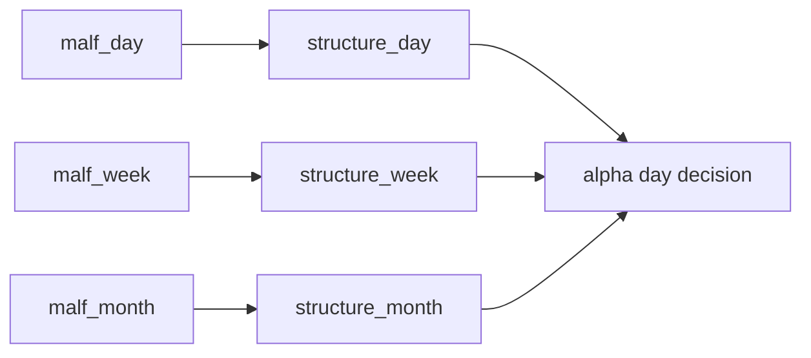

# structure 日周月薄投影分层与绑定收敛

`卡号`：`81`
`日期`：`2026-04-18`
`状态`：`草稿`

## 需求

- 问题：既然 `malf` 已拆成 `day / week / month` 三个正式真值库，`structure` 若仍只保留单 day 出口，周/月结构事实就缺少稳定投影层。
- 目标结果：把 `structure` 正式收敛为 `structure_day / structure_week / structure_month` 三个薄事实投影层，并完成 `2010-01-01` 至当前 official `market_base` 覆盖尾部的 bounded replay。
- 为什么现在做：`structure` 既要跟上 `malf` 的分层，又不能重新长成厚解释层；这件事需要单独一张卡冻结。

## 设计输入

- 设计文档：`docs/01-design/modules/system/18-malf-alpha-dual-axis-and-timeframe-native-refactor-charter-20260418.md`
- 规格文档：`docs/02-spec/modules/system/18-malf-alpha-dual-axis-and-timeframe-native-refactor-spec-20260418.md`

## 层级归属

- 主层：`structure`
- 次层：`alpha` 的高低周期结构上下文
- 上游输入：`80` 全覆盖后的 `malf_day / week / month`
- 下游放行：`82` 的 `filter_day`、`83` 的五 PAS 日线终审库，以及 `84` 的 bounded replay 审计
- 本卡职责：把 `structure` 收敛成 `D/W/M` 三个薄投影层，既跟上 `malf` 分层，又不长回厚解释层

## 任务分解

1. 把 `structure` 正式拆成 `structure_day / structure_week / structure_month` 三个官方库或等价三套正式账本出口。
2. 分别绑定到 `malf_day / malf_week / malf_month` 的对应 `malf_state_snapshot`。
3. 清理结构层越界裁决语义，只保留稳定结构事实与必要 sidecar 投影。
4. 完成 `2010-01-01` 至当前 official `market_base` 覆盖尾部的 `structure_day / week / month` bounded replay 与 truthfulness 证据。

## 实现边界

- 范围内：`structure runner/source/materialization` 的 `D/W/M` 三薄层绑定、薄投影约束与 bounded replay。
- 范围外：
  - 本卡不决定 `filter` 的 objective gate 形态
  - 本卡不改 `alpha` 的终审逻辑
  - 本卡不把 `structure` 重新做成厚解释层

## 历史账本约束

- 实体锚点：`asset_type + code`。
- 业务自然键：沿用各 `structure_snapshot` 既有自然键，不引入 run 级临时键替代正式事实。
- 批量建仓：支持 `2010-01-01` 至当前 official `market_base` 覆盖尾部的 bounded replay。
- 增量更新：`D/W/M` 三层各自沿用 checkpoint 续跑。
- 断点续跑：任一 timeframe 的 `structure` replay 中断后必须能独立恢复。
- 审计账本：每层保留 `structure_run / run_snapshot / summary_json + evidence`。

## 正式设计清单

| 设计项 | 正式口径 | 不接受情形 |
| --- | --- | --- |
| 三薄层出口 | `structure_day / week / month` 成为默认正式投影出口 | 继续只保留 day 单层出口 |
| 上游绑定 | 三层分别只读对应 `malf_day / week / month` 的 `malf_state_snapshot` | 跨层混读或回退到单库 `malf.duckdb` |
| 薄投影边界 | `structure` 只产结构事实与必要 sidecar，不持有 admission verdict | 重新夹带 `filter/alpha` 裁决 |
| 下游消费 | `filter_day` 只读 `structure_day`；`alpha` 可读 `structure_day / week / month` 上下文 | `filter` 直接吃周/月并长成多库 gate，或 `alpha` 丢失周/月上下文 |
| bounded replay | `2010-01-01 -> 当前 official market_base 覆盖尾部` 的 `D/W/M` replay 全部完成 | 只做 day，不做 week/month |
| truthfulness 说明 | 需要给出新旧口径差异与 bridge 回退退出说明 | 只改代码，不解释差异来源 |

## 实施清单

| 切片 | 实施内容 | 交付物 |
| --- | --- | --- |
| 切片 1 | 定义 `structure_day / week / month` 官方出口或等价三套账本 | 路径/表族说明 |
| 切片 2 | 分别绑定对应 `malf_*` 的 `malf_state_snapshot` | source 绑定说明 |
| 切片 3 | 清理越界裁决，只保留薄投影与必要 sidecar | 边界裁决 |
| 切片 4 | 完成 `2010-01-01 -> 当前` 尾部 `D/W/M` bounded replay | run 摘要 |
| 切片 5 | 回填 truthfulness 证据与 execution 闭环 | evidence / record / conclusion |

## A 级判定表

| 判定项 | A 级通过标准 | 阻断条件 | 对下游影响 |
| --- | --- | --- | --- |
| 三层绑定 | `structure_day / week / month` 与对应 `malf_*` 绑定稳定 | 任一层缺失或混读 | `82/83` 输入不稳 |
| 薄投影边界 | `structure` 不再承载终审或预裁决 | 仍带 verdict/过滤语义 | `alpha` 主权被侵蚀 |
| 下游消费关系 | `filter_day` 与 `alpha` 的消费边界写清 | `filter/alpha` 继续绕过或误读 `structure` | 卡组 authority 漂移 |
| bounded replay | `D/W/M` 三层尾部 replay 全部完成 | 只完成 day 或无证据 | `84` 无法审计 |
| truthfulness 说明 | 有新旧口径差异与回退边界说明 | 只有结果无解释 | cutover 不可追溯 |

## 收口标准

1. `structure_day / week / month` 与 `malf_day / week / month` 的绑定关系明确落地。
2. `structure` 不再回读 bridge v1 或单库 `malf.duckdb`。
3. 三层都只承载薄事实投影，不暗带终审结论。
4. 完成 `2010-01-01` 至当前 official `market_base` 覆盖尾部的 `D/W/M` bounded replay。
5. truthfulness 证据与旧口径差异说明明确。

## 卡片结构图

