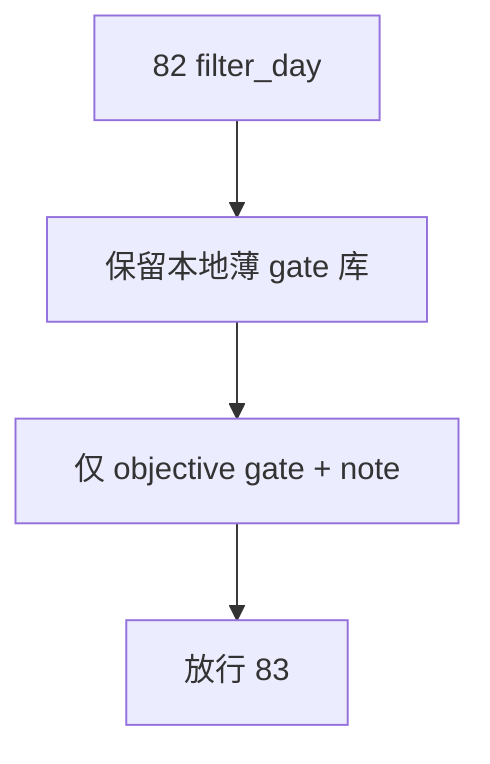

# filter_day 客观 gate 与 note sidecar 冻结 结论

结论编号：`82`
日期：`2026-04-18`
状态：`草稿`

## 预设裁决

- 接受：
  当 `filter_day` 被明确保留为正式本地薄 gate 库，且 hard block 只来自客观 gate 并输出稳定 `reject_reason_code`，完成 `2010-01-01` 至当前 official `market_base` 覆盖尾部的 bounded replay 时接受。
- 拒绝：
  如果 `filter` 继续悬空为“以后再决定要不要留库”，或继续承载结构性终审拦截，则拒绝。

## 预设原因

1. `filter` 的价值在于把客观 gate 标准化为稳定 reject code，而不是替 `alpha` 做裁决。
2. `filter` 服务的是日线决策入口，不需要再拆成 `D/W/M` 三库。

## 预设影响

1. `alpha` 可直接消费稳定的 `filter_day` 客观 gate 结果。
2. `83` 可以专注于五个 PAS 日线终审库，不再重复 objective gate 映射。

## 结论结构图

