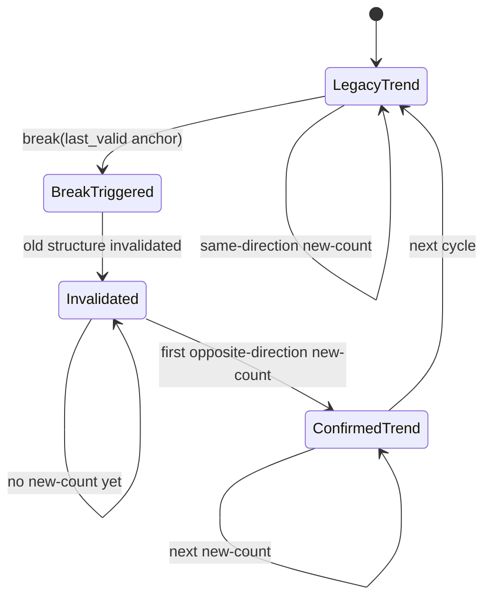
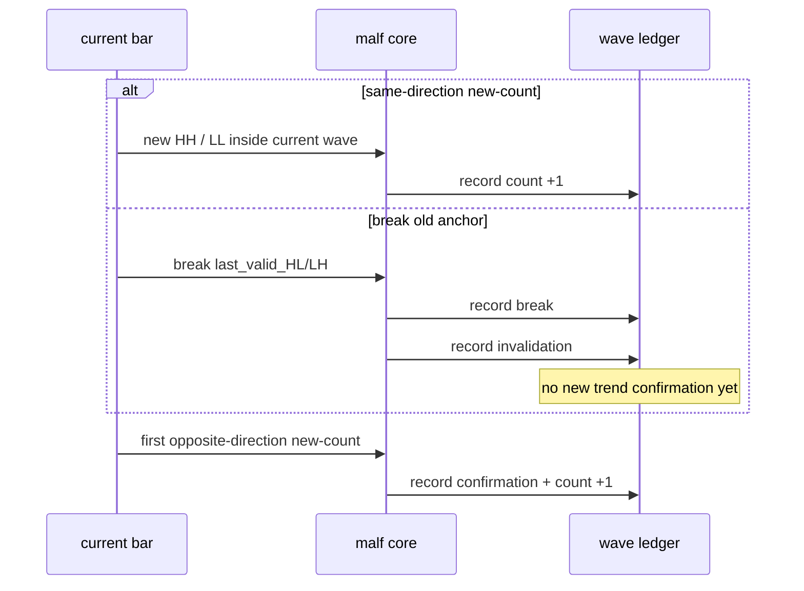
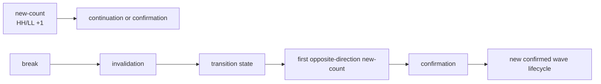

# malf break / invalidation / confirmation 正式合同冻结

`卡号`：`82`
`日期`：`2026-04-19`
`状态`：`草稿`

## 需求

- 问题：当前 canonical `malf` 里，`new-count`、`break`、旧结构失效与新结构确认之间没有被正式分层，导致推进事件缺位、`break` 被误当成确认，而大量只触发旧结构失效的 bar 被错误沉淀成完成 wave。
- 目标结果：把 `new-count / break / invalidation / confirmation` 冻结成正式 truth contract，明确什么是推进、什么是触发、什么是失效、什么是确认，以及这些语义如何映射到 `wave / state / snapshot`。
- 为什么现在做：`81` 已经证明当前偏差首先是 truthfulness 问题；`84` 之前不先冻结这层合同，任何修代码都会在“break 到底算不算新顺成立”上反复漂移。

## 设计输入

- 设计文档：`docs/01-design/modules/malf/17-malf-truth-contract-stale-guard-and-rebuild-governance-charter-20260419.md`
- 规格文档：`docs/02-spec/modules/malf/17-malf-truth-contract-stale-guard-and-rebuild-governance-spec-20260419.md`
- 语义来源：`docs/01-design/modules/malf/16-malf-origin-chat-semantic-reconciliation-charter-20260419.md`
- 当前 truth gap：`docs/03-execution/81-malf-origin-chat-semantic-truth-gap-freeze-card-20260419.md`
- 审计基线：`docs/03-execution/80-malf-zero-one-wave-filter-boundary-freeze-conclusion-20260418.md`

## 任务分解

1. 冻结 `new-count` 只表示当前方向产生新的有效 `HH / LL` 并推动 `hh_count / ll_count +1`。
2. 冻结 `break` 只表示旧结构门槛被击穿，不再允许它直接等价于新顺确认。
3. 冻结 `invalidation` 作为旧顺结构正式失效的账本解释，并明确它与 `牛逆 / 熊逆` 过渡态的关系。
4. 冻结 `confirmation` 只能由“第一笔有效 opposite-direction `new-count`”成立，不允许由单个 `break` 替代。
5. 明确 `wave_ledger / state_snapshot / downstream thin projection` 只读消费哪些语义层，不得反向简化掉合同分层。

## 实现边界

- 范围内：
  - `break / invalidation / confirmation` 的正式定义
  - 触发态、过渡态、确认态的边界
  - 与 `wave / state / snapshot` 的映射口径
- 范围外：
  - 本卡不直接修改 `canonical_materialization.py`
  - 本卡不直接重建 `malf_day / malf_week / malf_month`
  - 本卡不直接恢复 `91-95`

## 历史账本约束

- 实体锚点：`asset_type + code + timeframe`
- 业务自然键：沿用 canonical `pivot / wave / snapshot` 自然键；如需补充 truth stage，只能作为语义字段，不得让 `run_id` 变成主语义
- 批量建仓：本卡只冻结合同，不执行 rebuild
- 增量更新：后续增量计算必须能在同一合同下区分触发、失效、确认三层语义
- 断点续跑：后续 runner 续跑不得因为合同分层而破坏 `timeframe native` checkpoint
- 审计账本：`80` 的零一波段审计基线与本卡结论文档共同构成后续 `84/85` 的前置审计口径

## 状态机图

## 时序图

## 结构边界图

## 收口标准

1. `new-count / break / invalidation / confirmation` 四层语义被正式写入 card / evidence / record / conclusion。
2. `new-count` 被正式提升为状态机里的推进事件，而不再只是静态 `count` 字段说明。
3. `break != confirmation` 被明确钉死为正式合同，不再允许用口头解释替代。
4. 过渡态与确认态的账本映射被正式写清。
5. `83-85` 可以直接以本卡结论为上游输入。
