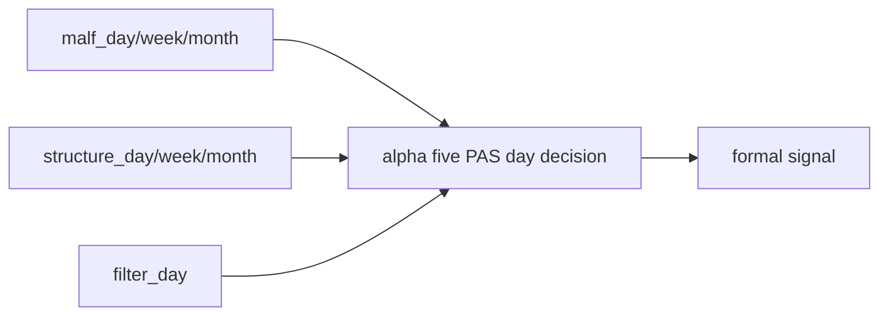

# alpha 五 PAS 日线终审重绑与 formal cutover

`卡号`：`83`
`日期`：`2026-04-18`
`状态`：`草稿`

## 需求

- 问题：`alpha` 虽然名义上负责 trigger 与 final verdict，但现实上长期被 `structure/filter` 预判和预裁决架空；同时五个 trigger 的账本形态也还没冻结清楚。
- 目标结果：把 `alpha` 明确重绑为五个 PAS 日线终审库：
  - `BOF / TST / PB / CPB / BPB`
  - 读取 `malf_day / week / month` 与 `structure_day / week / month` 上下文
  - 读取 `filter_day` 的 objective gate 结果
  - 但不为五个 trigger 各自再拆独立 `D/W/M` 三套账本
- 为什么现在做：只有把五个 PAS 的物理落库与“仍是日线决策库”同时冻结，`alpha` 才不会再次滑回单库混写或 `5 × 3` 膨胀。

## 设计输入

- 设计文档：`docs/01-design/modules/system/18-malf-alpha-dual-axis-and-timeframe-native-refactor-charter-20260418.md`
- 规格文档：`docs/02-spec/modules/system/18-malf-alpha-dual-axis-and-timeframe-native-refactor-spec-20260418.md`

## 层级归属

- 主层：`alpha`
- 次层：`position` 之前的最终 admitted/blocked formal signal 冻结层
- 上游输入：`malf_day / week / month`、`structure_day / week / month` 与 `filter_day`
- 下游放行：`84` 的 cutover gate，以及 `84` 通过后 `100-105` 对正式 `alpha` 上游的承接
- 本卡职责：把 `alpha` 明确重绑成五个 PAS 日线终审库，同时写死“读取周/月上下文，但不做 `5 × 3` 套 trigger 真值库”

## 任务分解

1. 冻结 `alpha_bof / alpha_tst / alpha_pb / alpha_cpb / alpha_bpb` 五个 PAS 官方库路径。
2. 冻结五库的默认消费口径：
   - `malf_day / week / month`
   - `structure_day / week / month`
   - `filter_day`
3. 冻结五个 PAS 仍是日线决策账本，不额外再拆 trigger-level `D/W/M` 三套库。
4. 把 objective gate、note sidecar 与 formal signal verdict 冻在 `alpha` 层。
5. 完成 `2010-01-01` 至当前 official `market_base` 覆盖尾部的五 PAS `trigger / family / formal_signal` bounded replay 与 cutover 证据。

## 实现边界

- 范围内：`alpha` 五 PAS 日线终审库、上下文绑定、bounded replay 与 formal cutover。
- 范围外：
  - 本卡不恢复 `position / portfolio_plan / trade / system`
  - 本卡不把五个 trigger 再扩成 `D/W/M` 三套独立账本

## 历史账本约束

- 实体锚点：`asset_type + code`。
- 业务自然键：沿用 `alpha_trigger_event / alpha_family_event / alpha_formal_signal_event` 既有自然键，并在五个 PAS 库内按 `pas_code` 做物理隔离。
- 批量建仓：支持 `2010-01-01` 至当前 official `market_base` 覆盖尾部的 bounded replay。
- 增量更新：沿用 trigger/family/formal signal 的 checkpoint / replay 口径续跑。
- 断点续跑：允许五个 PAS 各自中断后继续，不允许跨库手工短接。
- 审计账本：保留 `run / run_event / summary_json + truthfulness evidence`。

## 正式设计清单

| 设计项 | 正式口径 | 不接受情形 |
| --- | --- | --- |
| 五 PAS 官方库 | `alpha_bof / alpha_tst / alpha_pb / alpha_cpb / alpha_bpb` 成为默认物理落点 | 继续默认单 `alpha.duckdb` |
| 默认消费口径 | 五库统一读取 `malf_day / week / month`、`structure_day / week / month` 与 `filter_day` | 继续只接旧 bridge 输入或忽略周/月上下文 |
| 决策层级 | 五个 PAS 仍是日线终审账本，读取周/月上下文但不物化成 trigger-level `D/W/M` 三套真值库 | 膨胀成 `5 × 3` 独立账本 |
| 主权归属 | `admitted / blocked / downgraded / note_only` 与 `owner / reason / audit_note` 固定在 `alpha` | `filter/structure` 继续代持 verdict |
| bounded replay | 五 PAS `trigger / family / formal_signal` 都完成 `2010-01-01 -> 当前` 尾部 replay | 只做局部 PAS 或只有单层 replay |
| downstream 交接 | `84` 与 `100-105` 默认只承认五 PAS 日线正式库 | 继续允许下游回读 `alpha` 私有过程或单库混写 |

## 实施清单

| 切片 | 实施内容 | 交付物 |
| --- | --- | --- |
| 切片 1 | 冻结五 PAS 官方库路径与默认落表边界 | 路径/表族说明 |
| 切片 2 | 冻结统一上游消费口径：`malf D/W/M + structure D/W/M + filter_day` | 输入合同 |
| 切片 3 | 冻结 `alpha` 终审主权与“不做 `5 × 3`”边界 | authority 裁决 |
| 切片 4 | 完成五 PAS `trigger / family / formal_signal` 尾部 bounded replay | run/evidence |
| 切片 5 | 回填 truthfulness 差异说明与 execution 闭环 | record / conclusion / indexes |

## A 级判定表

| 判定项 | A 级通过标准 | 阻断条件 | 对下游影响 |
| --- | --- | --- | --- |
| 五 PAS 落点 | 五个 PAS 日线官方库成为默认真值库 | 仍默认单库或混库 | `84/100` 上游不稳 |
| 上下文消费 | 五库默认读取 `malf/structure` 的 `D/W/M` 上下文与 `filter_day` gate | 缺失周/月上下文或继续读 bridge 输入 | formal signal 语义不完整 |
| 终审主权 | `alpha` 成为唯一 admitted/blocked 主权层 | `filter/structure` 继续预裁决 | downstream authority 混乱 |
| 不做 `5 × 3` | 明确只保留五个日线 PAS 库 | trigger-level `D/W/M` 继续膨胀 | 库形态失控 |
| bounded replay | 五 PAS replay 全部完成并有证据 | 缺 PAS、缺层或缺证据 | `84` 无法放行 |

## 收口标准

1. `alpha` 成为唯一正式 `admitted / blocked / downgraded / note_only` 主权层。
2. 五个 PAS 日线官方库成为默认 `alpha` 真值落点。
3. 五个 trigger 不再被写成各自独立 `D/W/M` 三套账本。
4. 默认源码与 summary 不再把 `filter` 当最终 verdict 替身。
5. 完成 `2010-01-01` 至当前 official `market_base` 覆盖尾部的五 PAS bounded replay。
6. 与旧口径差异、owner / reason / audit_note 口径写清。

## 卡片结构图

