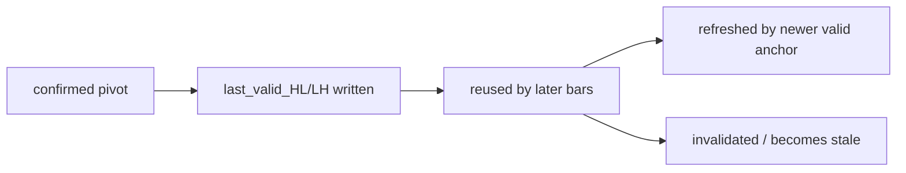
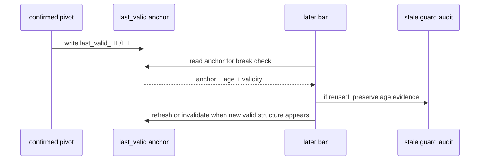
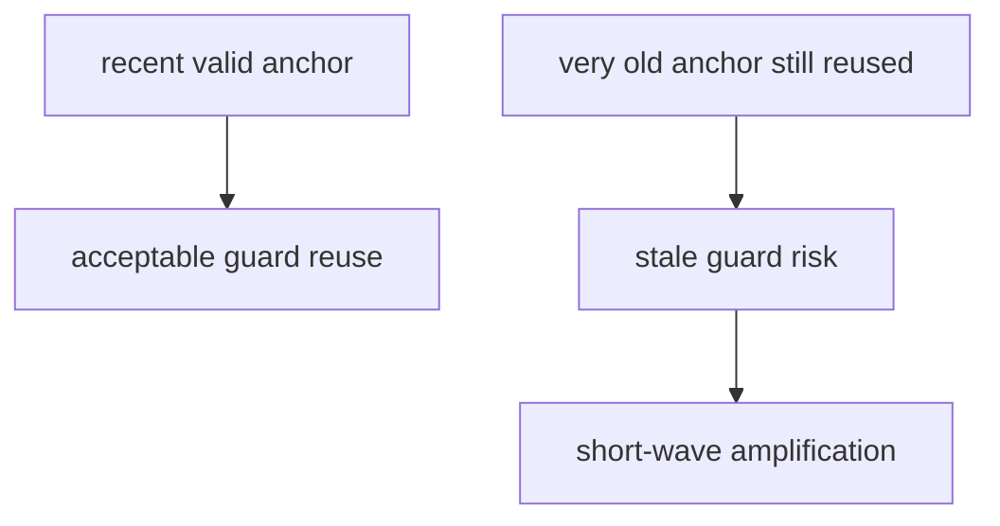

# malf last_valid 结构锚点与 stale guard 治理边界冻结

`卡号`：`83`
`日期`：`2026-04-19`
`状态`：`草稿`

## 需求

- 问题：`80` 的审计显示，`stale_guard_trigger` 占短 wave 的主量级，当前 `last_valid_HL / last_valid_LH` 被长期复用，但“为什么仍然有效”没有正式合同。
- 目标结果：冻结 `last_valid_HL / last_valid_LH` 的来源、生命周期、刷新条件、失效条件和 stale 审计边界。
- 为什么现在做：不先处理这层，`84` 只改 `switch_mode` 时序也会继续被陈旧 guard 放大成短 wave 链。

## 设计输入

- 设计文档：`docs/01-design/modules/malf/17-malf-truth-contract-stale-guard-and-rebuild-governance-charter-20260419.md`
- 规格文档：`docs/02-spec/modules/malf/17-malf-truth-contract-stale-guard-and-rebuild-governance-spec-20260419.md`
- 上游合同：`docs/03-execution/82-malf-break-invalidation-confirmation-contract-freeze-card-20260419.md`
- 审计基线：`docs/03-execution/80-malf-zero-one-wave-filter-boundary-freeze-conclusion-20260418.md`
- gap 冻结：`docs/03-execution/81-malf-origin-chat-semantic-truth-gap-freeze-card-20260419.md`

## 任务分解

1. 定义 `last_valid_HL / last_valid_LH` 只允许来自本级别已确认的最近有效结构锚点。
2. 定义 guard 的写入、继承、刷新、失效与审计字段。
3. 冻结 stale guard 的可接受边界与不可接受边界，并要求后续 `84/85` 保留 guard age 前后对照。
4. 明确 guard 问题属于 canonical truth 治理，不得推给 `structure / filter / alpha` 兜底。

## 实现边界

- 范围内：
  - `last_valid_HL / last_valid_LH` 生命周期合同
  - stale guard 审计口径
  - guard age / validity 的正式解释边界
- 范围外：
  - 本卡不直接改 guard 代码
  - 本卡不直接给出参数最优值
  - 本卡不提前执行三库 rebuild

## 历史账本约束

- 实体锚点：`asset_type + code + timeframe`
- 业务自然键：沿用 canonical `pivot / wave / snapshot` 自然键；guard age 与 validity 只作可审计属性，不得替代波段主键
- 批量建仓：本卡只冻结治理边界，不做 rebuild
- 增量更新：后续增量 runner 必须能复用同一套 guard 生命周期合同
- 断点续跑：guard 状态在 checkpoint 恢复后必须与重放语义一致
- 审计账本：`run_malf_zero_one_wave_audit.py` 的 `stale_guard_trigger` 基线与后续 rebuild 对照是本卡的核心审计依赖

## 生命周期图

## 时序图

## 风险分层图

## 收口标准

1. `last_valid_HL / last_valid_LH` 的生命周期合同被正式写清。
2. stale guard 的治理边界被正式写清，不再只靠样本描述。
3. `84` 可以直接拿本卡合同去改 canonical 代码与设计 rebuild。
4. `85` 可以直接拿本卡合同核对 guard age 是否明显收敛。
