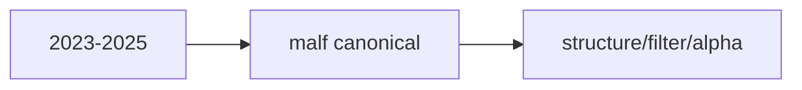

# mainline middle-ledger 2023-2025 bootstrap 卡
`卡号`：`84`
`日期`：`2026-04-14`
`状态`：`待施工`

## 需求

- 问题：在进入当年增量前，仍需补齐最近完整三年的正式历史窗口。
- 目标结果：完成 `2023-01-01 ~ 2025-12-31` 的中间库建库。
- 为什么现在做：这是最后一段完整三年窗口，直接为 `85` 的 `2026 YTD` 对齐做准备。

## 设计输入

- 设计文档：`docs/01-design/modules/system/17-official-middle-ledger-phased-bootstrap-and-real-data-pilot-charter-20260414.md`
- 规格文档：`docs/02-spec/modules/system/17-official-middle-ledger-phased-bootstrap-and-real-data-pilot-spec-20260414.md`

## 任务分解

1. 完成 `2023-2025` canonical `malf` 建库。
2. 完成 `2023-2025` downstream 重跑。
3. 为 `65` 的当年增量对齐准备最新 checkpoint。

## 实现边界

- 范围内：`2023-2025` 中间库建库。
- 范围外：`2026 YTD` 与 `trade / system`。

## 历史账本约束

- 实体锚点：沿用正式实体锚点。
- 业务自然键：沿用正式自然键。
- 批量建仓：本卡仅覆盖 `2023-01-01 ~ 2025-12-31`。
- 增量更新：当年增量由 `65` 承接。
- 断点续跑：继续服从正式 queue/checkpoint/replay。
- 审计账本：正式 run summary 与 execution evidence / record / conclusion 共同审计。

## 收口标准

1. `2023-2025` 建库完成。
2. 最新 checkpoint 足以承接 `2026 YTD`。
3. 无默认 bridge-v1 回退。
4. 证据、记录、结论闭环。

## 卡片结构图

