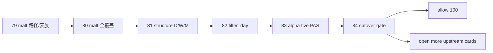

# malf alpha 官方真值与 cutover gate

`卡号`：`84`
`日期`：`2026-04-18`
`状态`：`草稿`

## 需求

- 问题：即使 `79-83` 都完成，也仍需要正式裁决新 `malf -> alpha` 主链是否已经成为官方默认口径。
- 目标结果：给出以下官方 cutover 裁决，并决定是否恢复 `100-105`：
  - `malf_day / week / month` 已完成全覆盖
  - `structure_day / week / month` 已完成 `2010-01-01` 至当前 official `market_base` 覆盖尾部 bounded replay
  - `filter_day` 已完成 `2010-01-01` 至当前 official `market_base` 覆盖尾部 bounded replay
  - `alpha` 五 PAS 日线库已完成 `2010-01-01` 至当前 official `market_base` 覆盖尾部 bounded replay
- 为什么现在做：没有这张 gate，前面所有卡都只是“代码与库已支持”，不是“官方默认口径已切换”。

## 设计输入

- 设计文档：`docs/01-design/modules/system/18-malf-alpha-dual-axis-and-timeframe-native-refactor-charter-20260418.md`
- 规格文档：`docs/02-spec/modules/system/18-malf-alpha-dual-axis-and-timeframe-native-refactor-spec-20260418.md`

## 任务分解

1. 审计 `malf_day / week / month` 的全覆盖、checkpoint、row/scope、date-range 与 freshness。
2. 审计 `structure_day / week / month` 是否已默认绑定对应 `malf_*` 并完成 `2010-01-01` 至当前 official `market_base` 覆盖尾部 bounded replay。
3. 审计 `filter_day` 是否已稳定承担 objective gate + note sidecar，且五类 hard block 已标准化为稳定 `reject_reason_code`。
4. 审计 `alpha` 五 PAS 日线库是否已默认绑定新口径，并确认没有扩成 trigger-level `D/W/M` 三套账本，且 bounded replay 范围只围绕 `2010-01-01` 至当前 official `market_base` 覆盖尾部。
5. 裁决是否允许恢复 `100-105`，或继续补开 upstream 卡。

## 实现边界

- 范围内：`malf -> alpha` 官方 truthfulness、cutover gate 与 `100-105` 放行裁决。
- 范围外：本卡不再继续重构 `trade / system`，也不做 bridge-era 物理删表。

## 历史账本约束

- 实体锚点：沿用既有模块正式锚点。
- 业务自然键：沿用既有自然键，本卡只做审计与裁决，不新造业务主键。
- 批量建仓：本卡不新建大规模账本，只审计 `79-83` 的结果。
- 增量更新：审计当前增量链是否已稳定落在新口径上。
- 断点续跑：本卡只审计 queue/checkpoint/freshness 是否闭环。
- 审计账本：`evidence / record / conclusion` 与 official run summary 共同构成本卡审计输入。

## 收口标准

1. `malf_day / week / month` 成为默认官方 `malf` 库，且已全覆盖。
2. `structure_day / week / month`、`filter_day` 与 `alpha` 五 PAS 日线库默认绑定新双主轴口径。
3. `structure / filter / alpha` 的 bounded replay 与 `malf` 的全覆盖被分别审计，而不是混写成一条完成度。
4. `100-105` 是否恢复有明确裁决。
5. `evidence / record / conclusion` 闭环。

## 卡片结构图

