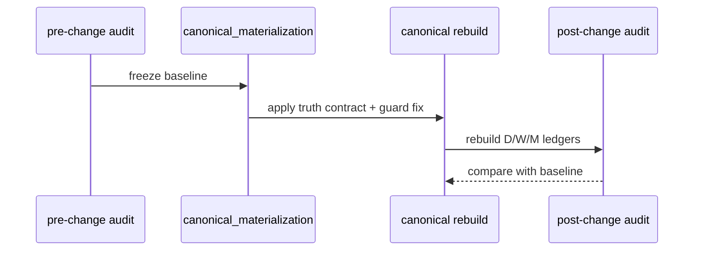
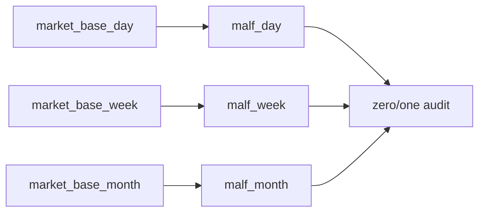
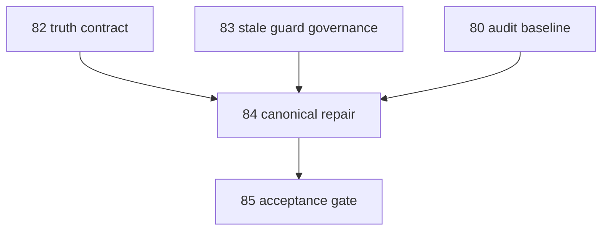

# malf canonical_materialization 修订与三库重建

`卡号`：`84`
`日期`：`2026-04-19`
`状态`：`草稿`

## 需求

- 问题：`82` 和 `83` 冻结后，当前 canonical 代码如果仍保留旧时序和 guard 复用逻辑，三库真值就不会自动扳正。
- 目标结果：在 truth contract 与 stale guard 边界明确后，正式修改 `canonical_materialization`，并在必要时重建 `malf_day / malf_week / malf_month`。
- 为什么现在做：这是整个 `81-85` 卡组里真正动刀的一张，但它必须排在 `82-83` 之后，不能反过来。

## 设计输入

- 设计文档：`docs/01-design/modules/malf/17-malf-truth-contract-stale-guard-and-rebuild-governance-charter-20260419.md`
- 规格文档：`docs/02-spec/modules/malf/17-malf-truth-contract-stale-guard-and-rebuild-governance-spec-20260419.md`
- 上游合同：`82`、`83`
- 审计基线：`docs/03-execution/80-malf-zero-one-wave-filter-boundary-freeze-conclusion-20260418.md`
- 当前 full coverage 基线：`docs/03-execution/91-malf-timeframe-native-base-source-rebind-conclusion-20260418.md`

## 任务分解

1. 以 `82` 为准修改 `break / invalidation / confirmation` 在 canonical 中的记账时序。
2. 以 `83` 为准修改 `last_valid_HL / last_valid_LH` 的刷新与失效逻辑。
3. 保留变更前零一波段审计基线，并生成变更后同口径对照。
4. 按 `timeframe native` 路径重建 `malf_day / malf_week / malf_month`，并补齐相应单测与证据。

## 实现边界

- 范围内：
  - `canonical_materialization.py` 正式修订
  - `run_malf_canonical_build.py` 所需 runner 调整
  - 三库 rebuild 与对应 evidence
- 范围外：
  - 不提前做 `91-95` downstream cutover
  - 不把 sidecar 逻辑回写成 `malf core`
  - 不跳过变更前/后审计对照

## 历史账本约束

- 实体锚点：`asset_type + code + timeframe`
- 业务自然键：保持 canonical `pivot / wave / progress / snapshot` 自然键稳定；允许语义字段调整，不允许把 rebuild run_id 变成业务主语义
- 批量建仓：必要时按 `timeframe native` 全量重建 `malf_day / malf_week / malf_month`
- 增量更新：重建后继续沿用 canonical `work_queue / checkpoint` 增量续跑，不允许退回一次性脚本口径
- 断点续跑：`D / W / M` 仍必须独立 checkpoint、独立恢复
- 审计账本：必须保存变更前/后 `run_malf_zero_one_wave_audit.py` 报告、rebuild run 证据与测试结果

## 修订时序图

## 三库结构图

## 卡组依赖图

## 收口标准

1. `canonical_materialization` 修订与三库 rebuild 被正式完成。
2. 变更前/后零一波段对照证据齐全。
3. 相关单测与治理检查通过。
4. `85` 可以直接拿本卡输出做 truthfulness 验收。
