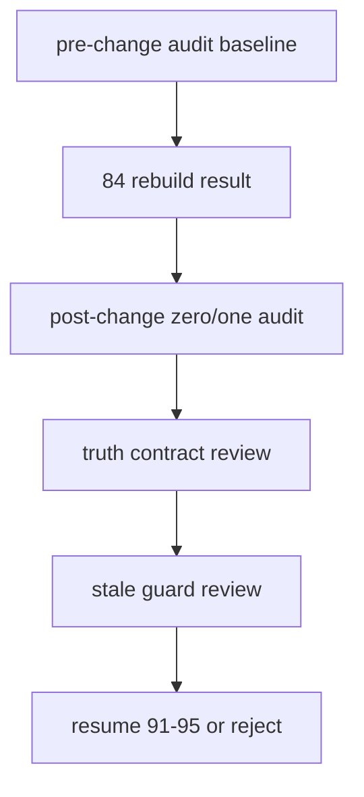
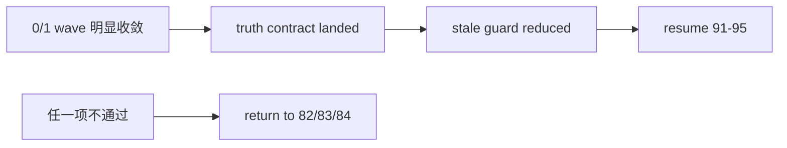
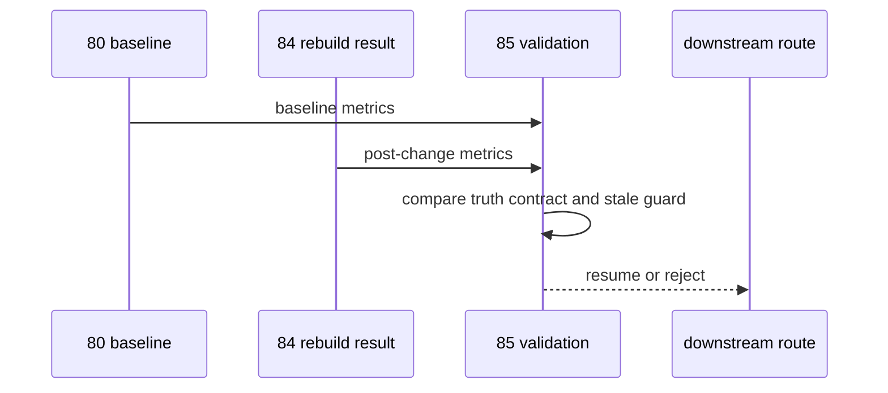

# malf 重建后 truthfulness 与审计验收闸门

`卡号`：`85`
`日期`：`2026-04-19`
`状态`：`草稿`

## 需求

- 问题：`84` 即使完成 rebuild，也不能默认宣布 `malf` 已经扳正。
- 目标结果：用正式验收闸门判断 `0/1 wave` 是否被真正压下去、truth contract 是否真正落地、是否允许恢复 `91-95`。
- 为什么现在做：没有这张卡，`84` 完成后很容易再次凭局部样本或下游感觉恢复 downstream cutover。

## 设计输入

- 设计文档：`docs/01-design/modules/malf/17-malf-truth-contract-stale-guard-and-rebuild-governance-charter-20260419.md`
- 规格文档：`docs/02-spec/modules/malf/17-malf-truth-contract-stale-guard-and-rebuild-governance-spec-20260419.md`
- 上游结果：`82`、`83`、`84`
- 基线审计：`docs/03-execution/80-malf-zero-one-wave-filter-boundary-freeze-conclusion-20260418.md`
- 当前 downstream 远置口径：`docs/03-execution/91-malf-timeframe-native-base-source-rebind-conclusion-20260418.md`

## 任务分解

1. 复跑 `run_malf_zero_one_wave_audit.py`，形成前后对照摘要。
2. 核对 `break / invalidation / confirmation` 是否已按 `82` 落地。
3. 核对 guard age 与 stale guard 占比是否已按 `83` 明显收敛。
4. 正式裁决是否允许恢复 `91-95`，若不允许则明确退回层级。

## 实现边界

- 范围内：
  - truthfulness 验收
  - 零一波段审计前后对照
  - 恢复或驳回 `91-95` 的正式裁决
- 范围外：
  - 本卡不再继续改 canonical 代码
  - 本卡不直接执行 downstream cutover
  - 本卡不以单个样本代替全量验收

## 历史账本约束

- 实体锚点：`asset_type + code + timeframe`
- 业务自然键：验收依赖 canonical 三库正式自然键与零一波段审计导出，不新造主业务键
- 批量建仓：只读消费 `84` 重建结果
- 增量更新：验收结论必须适配后续增量 runner，不得只对一次性 full 有效
- 断点续跑：验收通过后，后续 `D / W / M` 续跑口径必须与本卡裁决保持一致
- 审计账本：零一波段前后对照、truthfulness 复核摘要、恢复 `91-95` 的裁决结论

## 验收漏斗图

## 决策图

## 时序图

## 收口标准

1. 零一波段前后对照被正式保存并可追溯。
2. `82-84` 的关键合同落实情况被正式复核。
3. `91-95` 是否恢复得到正式裁决。
4. 若不通过，明确指出退回 `82`、`83` 或 `84` 的哪一层继续修。
