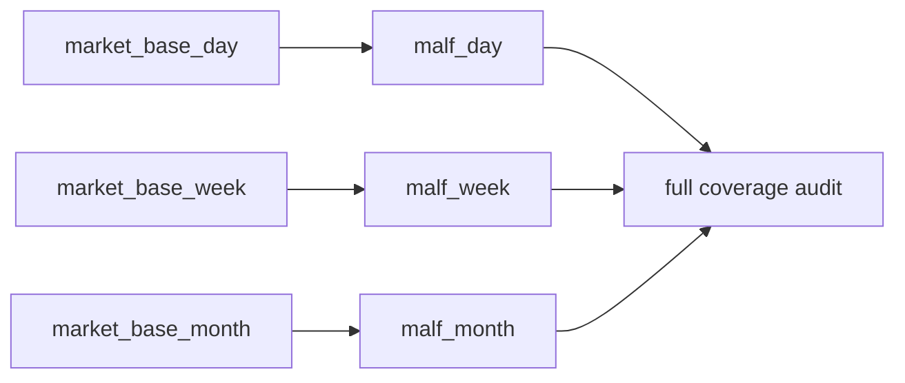

# malf timeframe native base source 重绑与全覆盖收口

`卡号`：`91`
`日期`：`2026-04-18`
`状态`：`草稿`

## 需求

- 问题：当前 `malf` 的 `W/M` 仍在内部从日线重采样，而不是直接消费 `market_base_week/month`；同时旧口径把 `malf` 也塞进 `2010 ~ 当前` bounded replay，和它作为公共真值层的职责冲突。
- 目标结果：`malf_day / week / month` 分别直接从 `market_base_day / week / month` 构建 canonical 账本，并完成三库全覆盖收口。
- 为什么现在做：如果 `91` 不把 `malf` 全覆盖做完，后面的 `92-95` 无论 replay 多漂亮，基座仍然不是正式真值层。

## 设计输入

- 设计文档：`docs/01-design/modules/system/18-malf-alpha-dual-axis-and-timeframe-native-refactor-charter-20260418.md`
- 规格文档：`docs/02-spec/modules/system/18-malf-alpha-dual-axis-and-timeframe-native-refactor-spec-20260418.md`

## 层级归属

- 主层：`malf`
- 次层：`canonical runner / source / materialization`
- 上游输入：`79` 已冻结的 `malf_day / week / month` 官方路径与 `80` 已冻结的 `0/1` 波段过滤边界
- 下游放行：`92-95` 对 `malf_*` 官方真值层的默认绑定，以及 `95` 的 full coverage 审计
- 本卡职责：把 `malf_day / week / month` 正式改成 timeframe native source，并把三库全覆盖写成硬收口标准

## 任务分解

1. 改 `run_malf_canonical_build` 与 `canonical_runner`，按 native timeframe 选择对应 `market_base_*` 和 `malf_*`。
2. 删除 `malf` 内部对 `W/M` 的日线 resample 默认路径，只保留必要兼容检查。
3. 用批次/child run/queue/checkpoint 完成 `malf_day / week / month` 三库全历史构建。
4. 输出 `D/W/M` 三库全覆盖 row/scope/date-range 审计摘要。

## 实现边界

- 范围内：`malf canonical runner/source/materialization` 的 timeframe native source 契约与全覆盖收口。
- 范围外：
  - 本卡不做 `structure / filter / alpha` 重绑
  - 本卡不重写 `market_base`
  - 本卡不接受“只做 `2010 ~ 当前` tail replay 就算 `malf` 完成”

## 历史账本约束

- 实体锚点：`asset_type + code`。
- 业务自然键：沿用 canonical `pivot / wave / snapshot` 既有自然键，库间只按 native timeframe 分隔。
- 批量建仓：必须支持三库全历史建仓，可分批执行，但收口标准是全覆盖。
- 增量更新：`D/W/M` 各自沿用 queue/checkpoint 增量追平。
- 断点续跑：任一 timeframe 全覆盖构建中断后必须能从对应库独立恢复。
- 审计账本：三库都要有 `run / work_queue / checkpoint / summary_json` 摘要。

## 正式设计清单

| 设计项 | 正式口径 | 不接受情形 |
| --- | --- | --- |
| source 绑定 | `malf_day / week / month` 分别只读对应 `market_base_day / week / month` | `week/month` 继续从日线内部 resample |
| 全覆盖标准 | 三库必须完成全历史全覆盖；允许分批执行，不允许降格为尾部 replay | 把 `2010-01-01 -> 当前` tail replay 当成 `malf` 收口 |
| child run 策略 | 允许用批次、child run、queue/checkpoint 串行推进全覆盖 | 退回一次性全量脚本或手工分段无审计 |
| 兼容检查 | 仅保留必要的 resample/旧路径兼容检查，不保留默认生产路径 | 兼容逻辑反客为主继续成为默认入口 |
| 覆盖审计 | 输出 `row/scope/date-range/freshness` 摘要，分别覆盖 `D/W/M` 三库 | 只报“已完成”，不给出范围摘要 |
| 下游口径 | `92-95` 默认绑定 full coverage 后的三库 `malf` | downstream 提前绑定半成品 `malf` |

## 实施清单

| 切片 | 实施内容 | 交付物 |
| --- | --- | --- |
| 切片 1 | 改 runner/source/materialization，按 native timeframe 选 `market_base_*` 与 `malf_*` | 代码与契约 |
| 切片 2 | 下线 `W/M` 默认日线重采样路径，只保留兼容检查 | source 边界说明 |
| 切片 3 | 以批次/child run/queue/checkpoint 完成三库全覆盖构建 | run 摘要 |
| 切片 4 | 输出 `row/scope/date-range/freshness` 全覆盖审计证据 | evidence |
| 切片 5 | 补单测与 execution 闭环 | tests / record / conclusion |

## A 级判定表

| 判定项 | A 级通过标准 | 阻断条件 | 对下游影响 |
| --- | --- | --- | --- |
| native source | `malf_week/month` 默认 source 已切到对应 `market_base_*` | 仍从 `day` resample | `92-95` 上游不可信 |
| 全覆盖收口 | `malf_day / week / month` 都完成全覆盖 | 任一 timeframe 只有 tail replay | `95` 无法放行 |
| 增量闭环 | `queue/checkpoint/child run` 语义在三库上都成立 | 只能靠一次性重跑 | 日后不可续跑 |
| 覆盖审计 | 有明确 `row/scope/date-range/freshness` 证据 | 只有模糊完成描述 | truthfulness 不可审计 |
| 测试与证据 | source 选择与全覆盖过程有测试/证据 | 只有代码改动无验证 | 卡不可收口 |

## 收口标准

1. `malf_week/month` 的 source 不再来自 `day` 内部 resample。
2. `malf_day / week / month` 三库都完成全覆盖，不接受“只做 `2010 ~ 当前` bounded replay”作为本卡收口。
3. 单测覆盖 source 选择与周月 native build。
4. 证据中明确给出三库全覆盖的 row/scope/date-range 摘要。

## 卡片结构图

