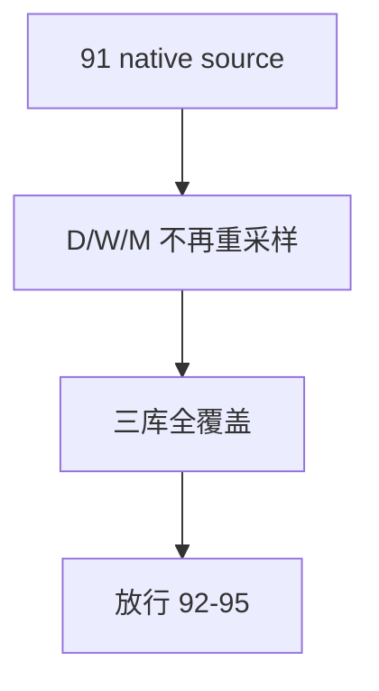

# malf timeframe native base source 重绑与全覆盖收口 结论

结论编号：`91`
日期：`2026-04-18`
状态：`接受`

## 裁决

- 接受：`run_malf_canonical_build` 已按 timeframe native 直接绑定 `market_base_day.stock_daily_adjusted / market_base_week.stock_weekly_adjusted / market_base_month.stock_monthly_adjusted`，不再以 day 内重采样充当 `W/M` 默认生产路径。
- 接受：`malf_day / malf_week / malf_month` 三库已完成官方 full coverage 建仓；三库最新 canonical run 均覆盖 `5501` 个标的 scope，checkpoint 全部追平到 `2026-04-10`。
- 接受：official native 三库都写入 `malf_ledger_contract(storage_mode='official_native')`，并在落表后保持单 timeframe 隔离。
- 拒绝：继续把 `W/M` 建在 day 内部 resample 上，或把 `2010 ~ 当前` tail replay 误当成 `malf` 全覆盖收口。

## 原因

1. `malf` 是 `structure / filter / alpha` 的公共语义真值层，source 契约如果仍停留在 day resample，`92-95` 就没有稳定上游。
2. `91` 的职责不是只把代码切成 native path，而是把 `malf_day / week / month` 三库正式建成可审计真值层；full coverage 不完成，`95` 无法判定 downstream cutover 的真伪。
3. `--limit 0` 已恢复为 canonical runner 的 full coverage 入口，避免 row limit 把 `5501` 个官方 scope 截断成局部样本。

## 影响

1. `91` 现在可以默认绑定 `malf_day / week / month` 的官方真值层，而不是继续依赖 legacy 单库或 day-resample 口径。
2. `95` 现在可以把“`malf` 已 full coverage”与“downstream 仍在 bounded replay / cutover”两类完成度明确拆开审计。
3. 当前正式待施工位从 `91` 推进到 `92-structure-thin-projection-and-day-binding-card-20260418.md`。

## 结论结构图

