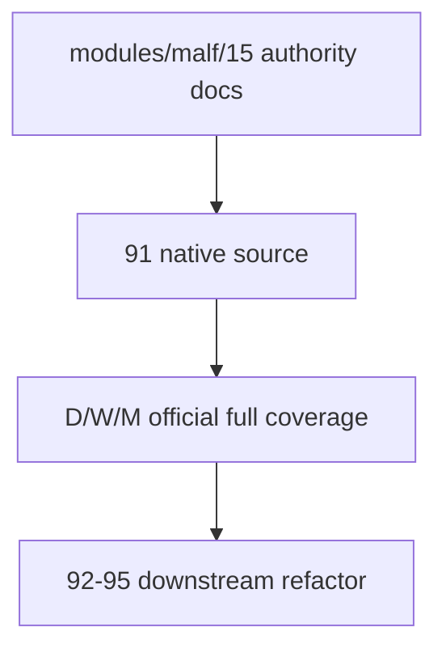

# malf 权威设计锚点补齐与 timeframe native base source 重绑收口 结论

`结论编号`：`91`
`日期`：`2026-04-19`
`状态`：`接受`

## 裁决

- 接受：`docs/01-design/modules/malf/15-malf-authoritative-timeframe-native-ledger-charter-20260419.md` 与 `docs/02-spec/modules/malf/15-malf-authoritative-timeframe-native-ledger-spec-20260419.md` 现在是当前 `malf` 的单点权威设计/规格锚点。
- 接受：`run_malf_canonical_build` 已按 timeframe native 直接绑定 `market_base_day.stock_daily_adjusted / market_base_week.stock_weekly_adjusted / market_base_month.stock_monthly_adjusted`，不再以 day 内重采样充当 `W/M` 默认生产路径。
- 接受：`malf_day / malf_week / malf_month` 三库已完成官方 full coverage 建仓；三库最新 canonical run 均覆盖 `5501` 个标的 scope，checkpoint 全部追平到 `2026-04-10`。
- 接受：official native 三库都写入 `malf_ledger_contract(storage_mode='official_native')`，并在落表后保持单 timeframe 隔离。
- 拒绝：继续只靠 `modules/malf/01-14` 的分段历史切片或系统级 `18` 去代替当前 `malf` 的完整权威说明。
- 拒绝：继续把 `W/M` 建在 day 内部 resample 上，或把 `2010 ~ 当前` tail replay 误当成 `malf` 全覆盖收口。

## 原因

1. `malf` 是 `structure / filter / alpha` 的公共语义真值层，source 契约如果仍停留在 day resample，`92-95` 就没有稳定上游。
2. 仅有系统级 `18` 还不够。用户在 `docs/01-design/modules/malf` 与 `docs/02-spec/modules/malf` 目录里需要能一眼找到最新、完整、直接描述 `malf` 全貌的文档，而不是自己从 `01-14` 切片里拼。
3. `91` 的职责不是只把代码切成 native path，而是把 `malf_day / week / month` 三库正式建成可审计真值层，并同时把这层真值的当前权威设计/规格正式钉死。
4. full coverage 不完成，`95` 无法判定 downstream cutover 的真伪；权威文档不补齐，后续实现边界和重建边界仍然会漂。

## 影响

1. 当前 `malf` 的推荐阅读不再是“先看系统级 `18` 再猜 `malf` 细节”，而是：
   - `91` 结论
   - `modules/malf/15` 设计
   - `modules/malf/15` 规格
   - `80` 结论
2. `92-95` 现在既有正式三库 truth layer，也有正式单点权威设计/规格可继承。
3. `0/1` 问题、后续算法修订与 potential rebuild，都必须同时服从：
   - `80` 的统一只读审计边界
   - `91` 的单点权威 `malf` 总设计/总规格
4. 当前正式待施工位仍然推进到 `92-structure-thin-projection-and-day-binding-card-20260418.md`。

## 证据

1. `docs/01-design/modules/malf/15-malf-authoritative-timeframe-native-ledger-charter-20260419.md`
2. `docs/02-spec/modules/malf/15-malf-authoritative-timeframe-native-ledger-spec-20260419.md`
3. `python -m pytest tests/unit/malf/test_canonical_runner.py tests/unit/malf/test_bootstrap_path_contract.py tests/unit/malf/test_malf_runner.py tests/unit/malf/test_mechanism_runner.py tests/unit/malf/test_wave_life_runner.py tests/unit/malf/test_wave_life_explicit_queue_mode.py -q`
4. `python .codex/skills/lifespan-execution-discipline/scripts/check_execution_indexes.py --include-untracked`
5. `python scripts/system/check_doc_first_gating_governance.py`

## 结论结构图

