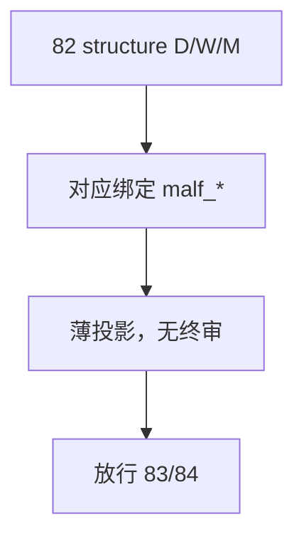

# structure 日周月薄投影分层与绑定收敛 结论

结论编号：`92`
日期：`2026-04-18`
状态：`草稿`

## 预设裁决

- 接受：
  当 `structure` 已稳定拆成 `D/W/M` 三个薄投影出口，并分别绑定对应 `malf_*`，且完成 `2010-01-01` 至当前 official `market_base` 覆盖尾部的 bounded replay 时接受。
- 拒绝：
  如果 `structure` 仍只保留单 day 出口，或在三层中夹带终审/准入裁决语义，则拒绝。

## 预设原因

1. `malf` 已三库化，`structure` 不跟随拆层就无法成为正式周/月结构出口。
2. `structure` 的价值在于薄投影，不在于重新接管解释权。

## 预设影响

1. `alpha` 可以在统一日线决策入口下读取 `structure_day / week / month` 上下文。
2. `83` 的 `filter_day` 可以只关注 day 决策入口，而不承担周/月结构投影职责。

## 结论结构图

