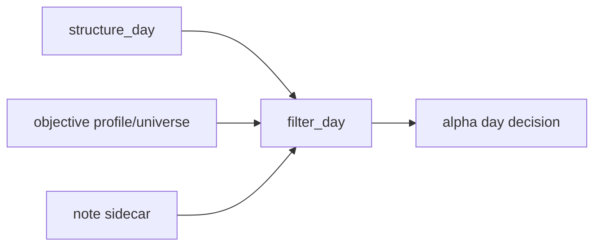

# filter_day 客观 gate 与 note sidecar 冻结

`卡号`：`93`
`日期`：`2026-04-18`
`状态`：`草稿`

## 需求

- 问题：`filter` 长期承担过多结构解释和预裁决权力，而且是否保留本地库一直悬而未决。
- 目标结果：明确 `filter` 的处理方案：
  - 保留一个 day 薄 gate 库
  - 只做 objective gate + note sidecar
  - 只服务日线 `alpha` 决策入口
- 为什么现在做：这件事不定清楚，`93` 以后所有讨论都会在“到底保不保留 `filter` 本地库”上反复回滚。

## 设计输入

- 设计文档：`docs/01-design/modules/system/18-malf-alpha-dual-axis-and-timeframe-native-refactor-charter-20260418.md`
- 规格文档：`docs/02-spec/modules/system/18-malf-alpha-dual-axis-and-timeframe-native-refactor-spec-20260418.md`

## 层级归属

- 主层：`filter`
- 次层：日线 `alpha` 决策入口的 objective gate
- 上游输入：`structure_day`、客观 profile/universe 事实，以及只读 note sidecar 摘要
- 下游放行：`94` 的 `alpha` 五 PAS 日线终审库与 `95` 的 gate 审计
- 本卡职责：把 `filter` 明确冻成一个保留的 `filter_day` 本地薄库，只负责客观 gate 与说明性 note

## 任务分解

1. 冻结 `filter_day` 为保留的正式本地薄库，不再继续悬置是否存在。
2. 把 `filter_day` 默认输入收敛成：
   - `structure_day`
   - 客观 profile / universe 事实
   - 必要 note sidecar（只读提示，可来自 `structure_day / week / month` 的薄投影摘要）
3. 冻结 hard block 只允许映射成稳定 `reject_reason_code`，且仅限以下 objective gate：
   - `suspended_or_not_resumed`：停牌 / 未复牌
   - `risk_warning_st`：风险警示 / ST
   - `delisting_arrangement`：退市整理
   - `security_type_out_of_universe`：证券类型不在正式宇宙
   - `market_type_out_of_universe`：市场类型不在正式宇宙
4. 冻结 note sidecar 只作说明，不形成终审 hard block。
5. 完成 `2010-01-01` 至当前 official `market_base` 覆盖尾部的 `filter_day` bounded replay。

## 实现边界

- 范围内：`filter_day` 的正式存在形式、输入边界、objective gate 映射、note sidecar 与 bounded replay。
- 范围外：
  - 本卡不把 `filter` 再拆成 `D/W/M` 三库
  - 本卡不重写 `alpha formal signal` 决策矩阵
  - 本卡不把 `filter` 变成终审层

## 历史账本约束

- 实体锚点：`asset_type + code`。
- 业务自然键：沿用 `filter_snapshot` 既有自然键。
- 批量建仓：支持 `2010-01-01` 至当前 official `market_base` 覆盖尾部的 bounded replay。
- 增量更新：通过 `filter_day` 的 run/checkpoint 续跑。
- 断点续跑：允许 queue/checkpoint 中断后恢复，不允许退化成一次性全量脚本。
- 审计账本：保留 `filter_run / run_snapshot / summary_json + objective coverage evidence`。

## 正式设计清单

| 设计项 | 正式口径 | 不接受情形 |
| --- | --- | --- |
| 本地薄库形态 | `filter_day` 保留为正式本地 day 级薄 gate 库 | 再把是否保留本地库写成待定 |
| 默认输入 | 默认只读 `structure_day`、客观 profile/universe 事实与只读 note sidecar | 直接消费 `position/trade` 语义，或强依赖周/月多库 gate |
| hard block 清单 | 仅五类 objective gate，可稳定映射 `reject_reason_code` | 把研究判断或结构解释写成 hard block |
| note sidecar | 只作说明/提示，不形成终审 verdict | note 反向控制准入 |
| 主权边界 | `filter` 不做最终 admitted/blocked 决策，终审仍在 `alpha` | `filter` 再次长成终审层 |
| bounded replay | `2010-01-01 -> 当前 official market_base 覆盖尾部` 的 `filter_day` replay 成立 | 没有 replay 证据或只给局部示例 |

## 实施清单

| 切片 | 实施内容 | 交付物 |
| --- | --- | --- |
| 切片 1 | 冻结 `filter_day` 作为保留的正式本地薄库 | 模块边界裁决 |
| 切片 2 | 收敛输入边界，明确 `structure_day / objective profile / note sidecar` | 输入合同 |
| 切片 3 | 固化五类 `reject_reason_code` 与 note-only 边界 | 字段与代码映射 |
| 切片 4 | 完成 `2010-01-01 -> 当前` 尾部 bounded replay，并摘要被拦样本 | run/evidence |
| 切片 5 | 回填 `93` execution 闭环 | record / conclusion / indexes |

## A 级判定表

| 判定项 | A 级通过标准 | 阻断条件 | 对下游影响 |
| --- | --- | --- | --- |
| 本地薄库存在 | `filter_day` 被明确保留且边界稳定 | 继续悬置保留与否 | `94` 输入摇摆 |
| objective gate 稳定 | 五类 hard block 全部映射成固定 `reject_reason_code` | reject 原因仍临时拼写 | replay 与审计不可信 |
| note 边界 | note sidecar 明确只读不拦截 | note 继续变相充当 verdict | `alpha` 主权被侵蚀 |
| day-only gate | `filter` 不再拆 `D/W/M` 多库 | 再把 `filter` 扩成多 timeframe gate | 模块职责膨胀 |
| bounded replay | `filter_day` 尾部 replay 与样本摘要成立 | 无 replay 证据 | `95` 无法审计 |

## 收口标准

1. `filter_day` 被明确冻结为保留的正式本地薄 gate 库。
2. hard block 只来自五类 objective gate，且输出稳定 `reject_reason_code`。
3. note sidecar 与 hard block 字段边界清楚。
4. `filter_day` 不再承载结构性终审主权。
5. 完成 `2010-01-01` 至当前 official `market_base` 覆盖尾部的 bounded replay，并给出被拦样本摘要。

## 卡片结构图

