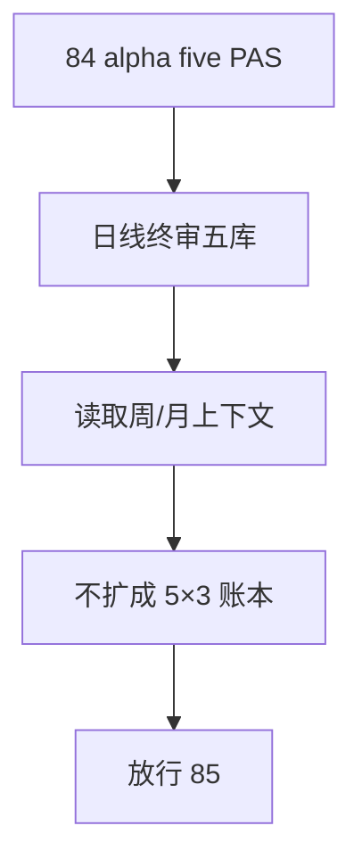

# alpha 五 PAS 日线终审重绑与 formal cutover 结论

结论编号：`94`
日期：`2026-04-18`
状态：`草稿`

## 预设裁决

- 接受：
  当 `alpha` 已稳定切到五个 PAS 日线官方库，并完成 `2010-01-01` 至当前 official `market_base` 覆盖尾部的 bounded replay，且没有把五个 trigger 再拆成独立 `D/W/M` 三套账本时接受。
- 拒绝：
  如果实现仍停留在单 `alpha.duckdb` 混写，或把五个 trigger 膨胀成 `5 × 3` 套正式账本，则拒绝。

## 预设原因

1. 五个 PAS 的正式分库是决策主权物理落点。
2. 周/月应该作为上游上下文输入，而不是再复制成 trigger-level 真值库。

## 预设影响

1. `95` 可以明确审计五 PAS 日线库是否已成为默认 `alpha` 真值层。
2. `100-105` 恢复前的 upstream 主权边界会变得稳定。

## 结论结构图

