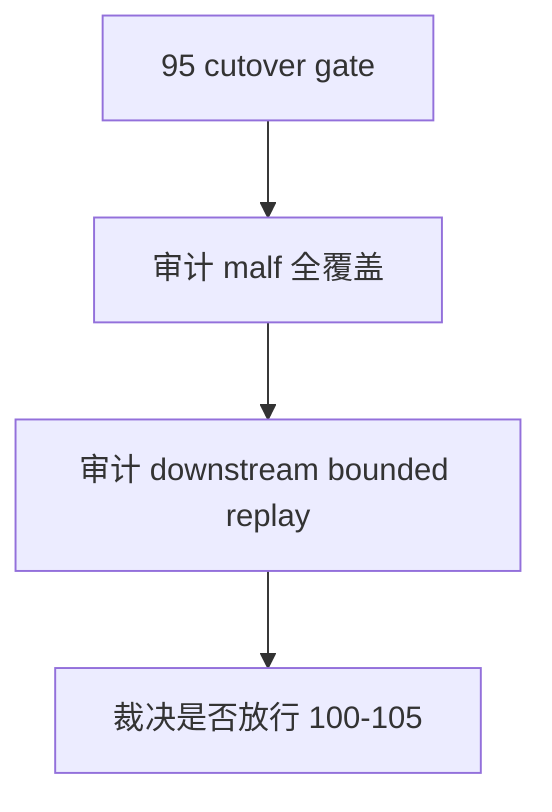

# malf alpha 官方真值与 cutover gate 结论

结论编号：`95`
日期：`2026-04-18`
状态：`草稿`

## 预设裁决

- 接受：
  当 `malf` 三库已全覆盖、`structure/filter/alpha` 已按新口径完成 `2010-01-01` 至当前 official `market_base` 覆盖尾部 bounded replay，并且 `alpha` 五 PAS 日线库成为默认终审层时接受。
- 拒绝：
  如果 `malf` 仍未全覆盖，或 downstream 仍未稳定绑定新口径，或五个 trigger 被扩成 `5 × 3` 套账本，则拒绝。

## 预设原因

1. `malf` 全覆盖与 downstream bounded replay 必须同时成立，才谈得上 cutover。
2. `100-105` 的恢复不能建立在半切换的 upstream 真值层上。

## 预设影响

1. 接受后才能恢复 `100-105`。
2. 拒绝时应明确回退到 `80/91/92/93/94` 中哪一张卡继续补齐。

## 结论结构图

