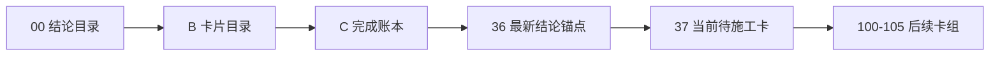

# 执行阅读顺序

日期：`2026-04-09`  
状态：`持续更新`

## 首读顺序

1. `00-conclusion-catalog-20260409.md`
2. `B-card-catalog-20260409.md`
3. `C-system-completion-ledger-20260409.md`
4. `36-malf-wave-life-probability-sidecar-bootstrap-conclusion-20260412.md`
5. `37-system-governance-historical-debt-backlog-burndown-card-20260412.md`

## 当前正式口径

1. 最新生效结论锚点已推进到 `36`。
2. 当前治理锚点仍是 `28`。
3. `29-36` 已完成并生效，当前主线后续卡组为：
   - `37 system governance 清账`
   - `100-105 trade/system 恢复`
4. `37` 已切换为当前待施工卡。

## 阅读顺序图


```
