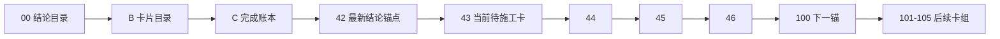

# 执行阅读顺序

日期：`2026-04-09`  
状态：`持续更新`

## 首读顺序

1. `00-conclusion-catalog-20260409.md`
2. `B-card-catalog-20260409.md`
3. `C-system-completion-ledger-20260409.md`
4. `42-alpha-family-role-and-malf-alignment-conclusion-20260413.md`
5. `43-structure-filter-alpha-data-grade-quality-gate-before-position-card-20260413.md`

## 当前正式口径

1. 最新生效结论锚点已推进到 `42`。
2. 当前治理收口已完成，但正式主线当前待施工卡已前移到 `43`，并顺排进入 `44 -> 45 -> 46`。
3. `29-42` 已完成并生效，当前主线后续卡组调整为：
   - `43-46 pre-position quality / hardening / acceptance`
   - `100-105 trade/system 收口`
4. `42` 已作为已完成的 alpha family / canonical malf 协同收口卡归档。

## 阅读顺序图

