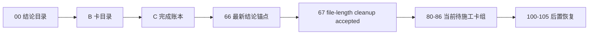

# 执行阅读顺序

`日期：2026-04-09`
`状态：持续更新`

## 首读顺序

1. `00-conclusion-catalog-20260409.md`
2. `B-card-catalog-20260409.md`
3. `C-system-completion-ledger-20260409.md`
4. `67-historical-file-length-debt-burndown-conclusion-20260415.md`
5. `66-mainline-rectification-resume-gate-conclusion-20260415.md`
6. `64-alpha-stage-percentile-decision-matrix-integration-conclusion-20260415.md`
7. `63-wave-life-official-ledger-truthfulness-and-bootstrap-conclusion-20260415.md`
8. `62-filter-pre-trigger-boundary-and-authority-reset-conclusion-20260415.md`
9. `61-structure-filter-tail-coverage-truthfulness-rectification-conclusion-20260415.md`
10. `60-mainline-rectification-batch-registration-and-scope-freeze-conclusion-20260415.md`
11. `80-mainline-middle-ledger-2011-2013-bootstrap-card-20260414.md`
12. `81-mainline-middle-ledger-2014-2016-bootstrap-card-20260414.md`

## 当前正式口径

1. 最新生效结论锚点已推进到 `67`。
2. 当前正式主线待施工卡已恢复到 `80`。
3. `29-67` 已完成并生效；当前主线后续卡组为：
- `80-84`：按三年窗口恢复 official middle-ledger 建库
- `85`：`2026 YTD` 正式增量对齐
- `86`：official middle-ledger cutover gate
- `100-105`：只在 `86` 放行后恢复
4. `66` 的正式裁决是“整改闭环已足以恢复 `80-86`”；`67` 现已完成历史 file-length 治理收口，因此 `80-86` 重新成为当前 active 卡组。

## 阅读顺序图

