# 执行阅读顺序

日期：`2026-04-09`  
状态：`持续更新`

## 首读顺序

1. `00-conclusion-catalog-20260409.md`
2. `B-card-catalog-20260409.md`
3. `C-system-completion-ledger-20260409.md`
4. `43-structure-filter-alpha-data-grade-quality-gate-before-position-conclusion-20260413.md`
5. `44-structure-filter-official-ledger-replay-smoke-hardening-card-20260413.md`
6. `45-alpha-formal-signal-producer-hardening-before-position-card-20260413.md`
7. `46-pre-position-upstream-acceptance-gate-card-20260413.md`
8. `47-position-malf-context-driven-sizing-and-batch-contract-card-20260413.md`
9. `48-position-risk-budget-and-capacity-ledger-hardening-card-20260413.md`
10. `49-position-batched-entry-trim-and-partial-exit-contract-card-20260413.md`
11. `50-position-data-grade-checkpoint-and-replay-runner-card-20260413.md`
12. `51-pre-portfolio-plan-position-acceptance-gate-card-20260413.md`
13. `52-portfolio-plan-official-ledger-family-and-natural-key-freeze-card-20260413.md`
14. `53-portfolio-plan-capacity-decision-ledger-hardening-card-20260413.md`
15. `54-portfolio-plan-data-grade-checkpoint-replay-and-freshness-card-20260413.md`
16. `55-pre-trade-upstream-data-grade-baseline-gate-card-20260413.md`

## 当前正式口径

1. 最新生效结论锚点已推进到 `43`。
2. 当前正式主线待施工卡已切到 `44`，并顺排进入 `45 -> 46 -> 47 -> 48 -> 49 -> 50 -> 51 -> 52 -> 53 -> 54 -> 55`。
3. `29-43` 已完成并生效，当前主线后续卡组调整为：
   - `44-46 structure/filter/alpha official hardening / acceptance`
   - `47-51 position quality / hardening / acceptance`
   - `52-55 portfolio_plan quality / hardening / acceptance`
   - `100-105 trade/system 收口`
4. `43` 已作为“允许继续 `44 -> 46`、但暂不允许进入 `47 -> 55 / 100 -> 105`”的正式质量闸门卡归档。

## 阅读顺序图

```mermaid
flowchart LR
    CONC["00 结论目录"] --> BCAT["B 卡片目录"]
    BCAT --> CLED["C 完成账本"]
    CLED --> ANC["43 最新结论锚点"]
    ANC --> G44["44 当前待施工卡"]
    G44 --> G45["45"]
    G45 --> G46["46"]
    G46 --> G47["47"]
    G47 --> G48["48"]
    G48 --> G49["49"]
    G49 --> G50["50"]
    G50 --> G51["51"]
    G51 --> G52["52"]
    G52 --> G53["53"]
    G53 --> G54["54"]
    G54 --> G55["55"]
    G55 --> NEXT["100 下一锚"]
    NEXT --> POST["101-105 后续卡组"]
```

