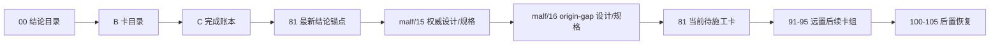

# 执行阅读顺序

`日期`：`2026-04-09`
`状态`：`持续更新`

## 首读顺序

1. `00-conclusion-catalog-20260409.md`
2. `B-card-catalog-20260409.md`
3. `C-system-completion-ledger-20260409.md`
4. `91-malf-timeframe-native-base-source-rebind-conclusion-20260418.md`
5. `15-malf-authoritative-timeframe-native-ledger-charter-20260419.md`
6. `15-malf-authoritative-timeframe-native-ledger-spec-20260419.md`
7. `16-malf-origin-chat-semantic-reconciliation-charter-20260419.md`
8. `16-malf-origin-chat-semantic-reconciliation-spec-20260419.md`
9. `80-malf-zero-one-wave-filter-boundary-freeze-conclusion-20260418.md`
10. `81-malf-origin-chat-semantic-truth-gap-freeze-card-20260419.md`

## 当前正式口径

1. 最新生效结论锚点已推进到 `91`。
2. `80` 已完成 `0/1` 波段过滤边界冻结；`91` 已完成 `malf day / week / month` 的 canonical timeframe native source rebind 与官方 full coverage，并已把 `modules/malf/15` 补齐为当前 `malf` 的单点权威设计/规格锚点；当前正式待施工卡已切回 `81-malf-origin-chat-semantic-truth-gap-freeze-card-20260419.md`。
3. 当前正式最近卡位先处理 `81`：它负责冻结 origin-chat `malf` 语义、当前 canonical truth gap 与后续修订顺序；`91-95` 继续作为远置的 downstream cutover 卡组保留。
4. 旧 middle-ledger 分窗建库卡组已删除，不再保留为现行执行路线。
5. `100-105` 仍然只在 `95` 放行后恢复。

## 阅读顺序图

