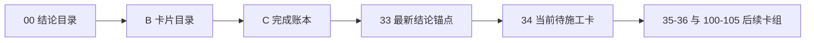

# 执行阅读顺序

日期：`2026-04-09`
状态：`持续更新`

## 首读顺序

1. `00-conclusion-catalog-20260409.md`
2. `B-card-catalog-20260409.md`
3. `C-system-completion-ledger-20260409.md`
4. `33-malf-downstream-canonical-contract-purge-conclusion-20260412.md`
5. `34-malf-multi-timeframe-downstream-consumption-card-20260411.md`

## 当前正式口径

1. 最新生效结论锚点已推进到 `33`。
2. 当前治理锚点仍是 `28`。
3. `29-33` 已完成并生效，当前 `malf` 后续卡组为：
   - `34-malf-multi-timeframe-downstream-consumption`
   - `35-downstream-data-grade-checkpoint-alignment-after-malf`
   - `36-malf-wave-life-probability-sidecar-bootstrap`
4. `100-105` 必须在 `34-36` 收口后再恢复推进。

## 阅读顺序图

