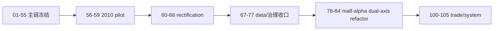

# 系统完成账本
`日期`：`2026-04-09`
`状态`：`持续更新`

1. 当前下一锤：`79-malf-day-week-month-ledger-split-path-contract-card-20260418.md`
2. 当前待施工卡：`79-malf-day-week-month-ledger-split-path-contract-card-20260418.md`
3. 正式主线剩余卡：`11`
4. 可选 Sidecar 剩余卡：`0`
5. 历史治理 backlog：`0`

## 已完成阶段

1. `01-55` 已完成治理基线、`data/malf/structure/filter/alpha/position/portfolio_plan` 主链第一轮冻结。
2. `56-59` 已完成 `2010` official middle-ledger pilot。
3. `60-66` 已完成 rectification、authority reset、wave life 与 formal signal admission 收口。
4. `67-77` 已完成 file-length、执行文档目录、objective gate、objective 历史回补、`market_base(backward)` 全历史修缮，以及 `raw/base day/week/month` 六库收口。

## 当前阶段

1. 最新生效结论锚点是 `78-malf-alpha-dual-axis-refactor-scope-freeze-conclusion-20260418.md`。
2. 当前正式主线待施工卡已切到 `79-malf-day-week-month-ledger-split-path-contract-card-20260418.md`。
3. 当前 active 卡组是 `79-84`，目标是先完成 `malf day/week/month` 三库路径与 source rebind，再完成 `structure day/week/month` 三薄层、`filter` 客观门卫，以及 `alpha` 五个 PAS 日线终审账本切换。
4. 旧 official middle-ledger 恢复范围已删除，当前只保留 `78-84` 新路线。
5. `100-105` 仍需等待 `84` 放行。

## 体系图

